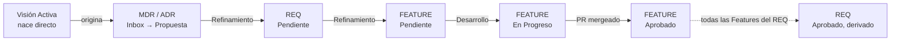

# SISTEMATIZACION.md – Manual de Gobernanza de la Documentación (Software)

Este documento establece el estándar oficial para la captura, organización y evolución de la
visión de producto, las decisiones técnicas y metódicas, los requisitos y las piezas de
implementación dentro de este repositorio, utilizando **Obsidian** y **GitHub** como núcleo del
flujo de trabajo.

La metodología es la especialización para software de `METODO_DOMER.md` (variante agnóstica), y
prioriza la trazabilidad del *porqué* por encima de la documentación estática — pero calibrando
el rigor exigido según cuánto compromiso genera cada tipo de nota: una Visión no compromete
ingeniería y se interroga poco; un ADR sí, y se interroga a fondo.

---

## 0. Registro de cambios respecto a v2.2.0

Esta es una versión mayor (breaking change), no incremental. Cambios principales:

- **Nuevo tipo `vision` (VA-XXX):** la Visión Activa deja de ser un concepto solo del método
  agnóstico y se formaliza para software, con su propia Definición de Listo.
- **Nuevo tipo `mdr` (MDR-XXX):** Decisión Metódica, hermana liviana de ADR, para decisiones de
  forma/paradigma que no comprometen arquitectura técnica.
- **Nuevo tipo `feature` (FEAT-XXX):** unidad ejecutable de bajo nivel que compone requisitos de
  alto nivel. Hereda del REQ la responsabilidad de tener rama, PR y Definición de Hecho de código.
- **REQ cambia de rol:** pasa de "unidad implementable" a "funcionalidad de alto nivel"; su
  `status: Aprobado` ahora se deriva del estado de sus Features, no de un merge directo.
- **Segmentación oficial del repositorio:** se formaliza `docs/`, `software/`, `build/` y
  `.github/` como áreas de primer nivel, con una regla explícita para decidir qué vive en `docs/`
  (se decidió conscientemente) y qué vive en `build/` (se genera del código).
- **GitFlow actualizado:** las ramas `feature/` ahora se nombran por `FEAT-XXX`, no por `REQ-XXX`.
- Se agregan las convenciones `mdr/` para ramas de discusión/spike asociadas a una MDR.

---

## 1. Segmentación del repositorio

Antes de esta versión, el manual solo gobernaba `docs/` y asumía el resto del repositorio sin
definirlo. Esa omisión se resuelve aquí, aplicando el propio método sobre sí mismo: la
segmentación no es un sistema aparte, nació como cualquier otra decisión — un Inbox, un ADR, N
REQ, N Features — y su resultado es este apartado.

```text
repo-root/
├── docs/          # Fuente de verdad de la gobernanza: visión, decisiones, requisitos, features.
├── software/       # Código fuente del producto.
├── build/          # Artefactos generados: builds, schemas autogenerados, referencia técnica derivada.
├── .github/        # Workflows de CI/CD, plantillas de Issues y Pull Requests.
└── SISTEMATIZACION.md  → vive dentro de docs/, referenciado aquí por claridad.
```

**Regla de frontera `docs/` vs `build/`:**

> Si alguien tuvo que decidir esto conscientemente, pertenece a `docs/`. Si se puede derivar o
> regenerar automáticamente desde el código, pertenece a `build/`.

Ejemplo de referencia (ver también sección 9.4): la decisión de usar YAML para un esquema de
estilos es un ADR (`docs/`). El listado exhaustivo de claves YAML válidas, generado desde el
código, es referencia técnica (`build/`) — sin importar si ese YAML es editado por un usuario
final o es puramente interno. Lo que sí pertenece a `docs/` es la **especificación de diseño**
de ese esquema en la Feature correspondiente (ver sección 4.4), redactada *antes* de que el
código exista.

Esta regla es intencionalmente la misma prueba, aplicada un nivel más arriba, con la que ya se
distingue un REQ de una Feature (ver sección 9).

---

## 2. Estructura del directorio (`docs/`)

```text
docs/
├── 00_Inbox/            # Captura rápida de ideas, feedback sin procesar y notas de reuniones.
├── 01_Product/          # Visión de negocio, roadmaps, alcance, usuarios objetivo.
│   └── Vision/          # VA-XXX.md — la única nota que NO pasa por el Inbox.
├── 02_Requirements/     # Requisitos de alto nivel (REQ-XXX).
│   └── _Templates/      # Plantillas reutilizables de todas las notas.
├── 03_Architecture/     # Decisiones de Arquitectura (ADR-XXX) y Decisiones Metódicas (MDR-XXX).
├── 04_Features/         # Elementos ejecutables de bajo nivel (FEAT-XXX). (NUEVO)
├── 05_Sprints/          # Planificación cíclica, minutas y revisiones.
│   ├── Sprint-01/
│   └── Sprint-02/
├── 06_Testing/          # Casos de prueba (TC-XXX), planes de validación (opcional).
├── _Archive/            # Notas obsoletas o deprecadas que se conservan por trazabilidad.
└── SISTEMATIZACION.md   # Este manual.
```

**Reglas de uso:**
- `00_Inbox/` no requiere estructura inicial; aquí se vuelca cualquier pensamiento.
- **Toda nota nace en `00_Inbox/`, excepto la Visión Activa.** La VA es la semilla del sistema:
  no puede pasar por refinamiento porque el refinamiento necesita una VA vigente para anclarse.
  MDR, ADR, REQ y FEAT nacen todas en Inbox y solo se mueven a su carpeta cuando cumplen su
  Definición de Listo (sección 5).
- `02_Requirements/`, `03_Architecture/` y `04_Features/` solo contienen notas con frontmatter
  válido.
- `03_Architecture/` contiene tanto ADR como MDR — comparten carpeta porque ambas son decisiones,
  pero llevan numeración independiente (`ADR-001`, `MDR-001`, sin contador compartido).
- `_Archive/` recibe las notas con `status: Deprecado` o `Superada` que ya no están activas.

---

## 3. Jerarquía general del sistema

```text
Visión Activa (VA)  ── 1 ──────────► N  MDR / ADR
                                            │
                                          1 ──────► N  REQ
                                                          │
                                                        N ◄──────► M  FEATURE
```

- **VA → MDR/ADR** es 1:N y es un árbol limpio: cada MDR/ADR tiene exactamente una `vision_origen`.
- **MDR/ADR → REQ** es 1:N y también es árbol: cada REQ tiene exactamente **un** `origen`
  (`ADR-XXX` o `MDR-XXX`, nunca una lista — ver sección 9.2).
- **REQ ↔ FEATURE** es N:M, no un árbol: una Feature de bajo nivel puede materializar piezas de
  varios REQ de alto nivel, y un REQ puede necesitar varias Features para completarse. Esta es la
  única relación de composición del sistema — está contenida ahí a propósito y no se filtra hacia
  los niveles superiores (ver sección 9.3).

---

## 4. Estándar de Metadatos (Propiedades Frontmatter)

### 4.0 Plantilla para Visión Activa (`01_Product/Vision/VA-XXX.md`)

```yaml
---
tipo: vision
id: VA-XXX
status: Borrador          # Borrador | Activa | Superada
naturaleza:                # libre, opcional — p.ej. Comercial | Hipótesis-solución | Herramienta
dominios: []               # emergente — se puebla cuando el primer MDR/ADR lo requiere, no al nacer
alternativas_evaluadas: false  # señal de madurez, NO gatea el paso a Activa
---
```

**Cuerpo — Definición de Listo (DoR) para `status: Activa`:**

1. **Qué es y cómo se usa** — un solo bloque de contenido; no se fuerza a separar "qué" de "cómo"
   ni de "para quién" salvo que el producto lo pida naturalmente.
2. **Lo que no es** (el nombre del campo es libre por proyecto — "Alcance", "Fuera de límites",
   lo que se entienda mejor — pero el contenido es obligatorio): evita que cualquier MDR/ADR
   futuro pueda alegar que "encaja" cuando en realidad no.
3. **Alternativas cercanas y por qué esto en vez de eso** — recomendado, señal de madurez de la
   VA, pero **no bloquea** el paso a `Activa`. Su peso real depende del tipo de producto: en una
   utilidad que compite con herramientas existentes es casi obligatorio de facto; en una idea sin
   precedente claro puede omitirse sin problema.

`naturaleza` y `dominios` quedan **fuera** de la DoR — no se exigen al activar la VA. `dominios`
crece incrementalmente: el primer MDR/ADR que necesite un pilar nuevo lo propone y ahí se
formaliza en la lista.

### 4.1 Plantilla para Decisiones de Arquitectura (`03_Architecture/ADR-XXX.md`)

```yaml
---
tipo: adr
id: ADR-XXX
status: Propuesto        # Propuesto | Aceptado | Superado
fecha: YYYY-MM-DD
vision_origen: VA-XXX     # obligatorio
dominio: "Nombre del pilar"  # obligatorio en ADR — a diferencia de MDR, donde es opcional
reemplaza: ADR-000
superado_por:
rama: "adr/ADR-XXX-descripcion"
requisitos_derivados:
  - REQ-XXX
---
```

### 4.2 Plantilla para Decisiones Metódicas (`03_Architecture/MDR-XXX.md`) — NUEVO

```yaml
---
tipo: mdr
id: MDR-XXX
status: Propuesta        # Propuesta | Aceptada | Superada
fecha: YYYY-MM-DD
vision_origen: VA-XXX     # obligatorio
dominio:                  # opcional, a diferencia de ADR
reemplaza: MDR-000
superada_por:
rama: "mdr/MDR-XXX-descripcion"
requisitos_derivados:
  - REQ-XXX
---
```

**Criterio de bifurcación entre ADR y MDR** (regla oficial, sustituye cualquier heurística
anterior de "costo de reversión"):

> MDR decide la **forma o paradigma** de la solución — todavía habla el lenguaje de la Visión
> ("cómo se experimenta este producto"). ADR decide la **tecnología concreta** que materializa esa
> forma una vez elegida.

Ejemplo: "el producto tendrá una versión web" es MDR (forma). "Usaremos React con
Server-Side Rendering para esa versión web" es ADR (tecnología que implementa la forma). Un MDR
puede preceder y originar un ADR posterior; lo contrario no aplica.

### 4.3 Plantilla para Requisitos (`02_Requirements/REQ-XXX.md`)

```yaml
---
tipo: requisito
id: REQ-XXX
status: Pendiente        # Pendiente | En Progreso | Aprobado | Deprecado
prioridad: Alta          # Crítica | Alta | Media | Baja
modulo: Core
origen: ADR-XXX           # o MDR-XXX — exactamente UNA decisión, nunca una lista
responsable: "@usuario"
sprint: "Sprint-03"
---
```

**Regla de origen único (no admite excepción):** un REQ nunca tiene dos decisiones de origen en
el frontmatter. Si una funcionalidad de alto nivel parece depender de dos decisiones a la vez, se
parte en dos REQ (cada uno con su propio origen) y se recompone después en una Feature. Si una
decisión adicional simplemente *informa* al REQ sin originarlo, se registra en el cuerpo bajo
"Decisión Técnica Relacionada" (sección 6), nunca en el frontmatter.

`status: Aprobado` ya **no se marca manualmente en un merge** — se deriva de que todas las
Features asociadas (ver 9.3) estén `Aprobada`. Como Dataview solo lee y no escribe frontmatter,
este campo debe actualizarse explícitamente (a mano o vía script/Templater) cuando la última
Feature se aprueba; el Dashboard puede mostrar el conteo "Features aprobadas / total" como apoyo,
pero no sustituye la actualización del campo.

### 4.4 Plantilla para Features (`04_Features/FEAT-XXX.md`) — NUEVO

```yaml
---
tipo: feature
id: FEAT-XXX
status: Pendiente         # Pendiente | En Progreso | Aprobado | Deprecado
requisitos:                # lista — aquí vive la composición N:M, NO hay campo espejo en REQ
  - REQ-XXX
  - REQ-YYY
responsable: "@usuario"
rama: "dominio/FEAT-XXX-descripcion-vX.Y"
referencia_build:          # opcional — ruta a la referencia generada en build/, si aplica
---
```

No se agrega un campo inverso `features_consumidoras` en REQ: para responder "¿qué Features usan
este REQ?" se consulta con Dataview (`WHERE contains(requisitos, "REQ-XXX")`), evitando mantener
dos listas sincronizadas a mano.

### 4.5 Plantilla para Casos de Prueba (`06_Testing/TC-XXX.md`) (opcional)

```yaml
---
tipo: test-case
id: TC-XXX
status: Diseñado          # Diseñado | Automatizado | Ejecutado | Fallido
feature: FEAT-XXX          # los TC validan la implementación, cuelgan de Feature, no de REQ
modulo: Core
---
```

---

## 5. Definición de Listo (DoR) y Definición de Hecho (DoD) por tipo

### 5.1 VA — Visión Activa
Ver DoR completa en sección 4.0. No tiene DoD: una VA no se "termina", se supera (`Superada`)
cuando otra VA la reemplaza.

### 5.2 MDR — Decisión Metódica
**DoR** (Inbox → `03_Architecture/`, `status: Propuesta`):
- `vision_origen` documentado, VA en `status: Activa`.
- La decisión describe forma/paradigma, no tecnología (si describe tecnología, es candidata a ADR).
- Justificación redactada contra el "qué es y cómo se usa" o "lo que no es" de la VA.

**DoD** (`status: Aceptada`): issue de discusión referenciado, sin objeciones abiertas. No exige
`requisitos_derivados` poblado todavía.

### 5.3 ADR — Decisión de Arquitectura
**DoR** (Inbox → `03_Architecture/`, `status: Propuesto`):
- `vision_origen` documentado, VA en `status: Activa`.
- `dominio` identificado — obligatorio (a diferencia de MDR).
- Justificación redactada contra ese dominio, no contra un caso de uso aislado.
- **Al menos una alternativa considerada** — exigible aquí, a diferencia de la VA, porque un ADR
  es caro de revertir.
- Las categorías de capacidad que habilita están esbozadas (no la sintaxis exhaustiva — eso es
  `build/`, ver sección 1).

**DoD** (`status: Aceptado`): issue de discusión referenciado, sin objeciones abiertas.
`requisitos_derivados` puede seguir vacío al aceptarse; se puebla en el refinamiento posterior.

### 5.4 REQ — Requisito de alto nivel
**DoR** (Inbox → `02_Requirements/`, `status: Pendiente`):
- Título descriptivo y actor identificado.
- Al menos un párrafo en "El Por Qué".
- `origen` obligatorio, exactamente un `ADR-XXX` o `MDR-XXX` — nunca lista.
- Criterios de aceptación iniciales esbozados (pueden refinarse después).

**DoD** (`status: Aprobado`):
- Todas las Features listadas en `requisitos` de cada FEAT que lo referencian están en `Aprobado`.
- Los criterios de aceptación están verificados.
- Los TC asociados (vía sus Features) están en `Ejecutado` y pasan.

### 5.5 FEATURE — Elemento ejecutable
**DoR** (Inbox → `04_Features/`, `status: Pendiente`):
- `requisitos` con al menos un REQ existente y válido — una Feature no puede nacer huérfana (a
  diferencia de un ADR, que sí puede aceptarse sin REQ derivados todavía).
- Alcance ejecutable y concreto: un programador debe poder empezar a trabajar sin ambigüedad.
- Especificación de diseño esbozada (ver sección 6.3) cuando la Feature involucra una decisión de
  estructura/formato que el código deba seguir.

**DoD** (`status: Aprobado`) — Feature hereda el DoD de código que antes tenía REQ:
- El código asociado ha sido fusionado en la rama principal.
- Los criterios de cumplimiento están verificados (pruebas manuales o automatizadas).
- Los TC relacionados (si existen) están en `Ejecutado` y pasan.
- La nota está vinculada a su Issue y PR.

---

## 6. Anatomía de las notas

### 6.1 Nota de Requisito

```markdown
# [REQ-XXX] Nombre Descriptivo del Requisito

## 🎯 1. El "Por Qué"
*¿Qué problema técnico o de negocio resuelve? ¿Por qué es necesario ahora?*

## 👥 2. Actores y Alcance
*¿Quién interactúa con esta funcionalidad? ¿Qué queda explícitamente fuera?*

## 📋 3. Criterios de Aceptación
- [ ] Dado que [contexto inicial], cuando [acción], entonces [resultado esperado].

## ⚠️ 4. Notas Técnicas Preliminares (Opcional)

## 🔗 5. Trazabilidad
*   **Origen (ADR o MDR):** [[ADR-XXX]] o [[MDR-XXX]]
*   **Decisión Técnica Relacionada:** [[ADR-YYY]] (informa, no origina)
*   **Features que lo materializan:** [[FEAT-XXX]], [[FEAT-YYY]]
```

### 6.2 Nota de Feature — NUEVO

```markdown
# [FEAT-XXX] Nombre Descriptivo de la Feature

## 🎯 1. Por Qué
*Qué necesidad de los REQ de origen resuelve esta pieza concreta.*

## 🛠️ 2. Especificación de Diseño (para quien la construye)
*Estructura, categorías, decisiones de forma que el programador debe seguir.
No es sintaxis exhaustiva — eso se genera después y vive en build/ (ver sección 1).*

## 📋 3. Criterios de Cumplimiento
- [ ] Dado que [contexto], cuando [acción], entonces [resultado esperado].

## 🔗 4. Trazabilidad
*   **Requisitos que materializa:** [[REQ-XXX]], [[REQ-YYY]]
*   **Implementación:** [Enlace al Pull Request]
*   **Casos de Prueba:** [[TC-XXX]]
*   **Referencia generada:** `build/...` (si aplica)
```

### 6.3 Nota de Visión Activa y de ADR/MDR
Siguen la estructura de la sección 4.0, 4.1 y 4.2 respectivamente; el cuerpo desarrolla cada
campo del frontmatter en prosa.

---

## 7. Ciclo de Vida de una Nota (El Flujo de Trabajo)



**Fases:**

1. **Semilla (VA):** nace directo en `01_Product/Vision/`, sin pasar por Inbox.
2. **Captura (Inbox):** todo lo demás — ideas de MDR, ADR, REQ o FEAT — se anota libremente en
   `00_Inbox/`.
3. **Refinamiento (sesión, usando la skill de refinamiento DOMER):** cada nota de Inbox se
   clasifica y, si cumple su DoR (sección 5), recibe ID y se mueve a su carpeta.
4. **Desarrollo:** ocurre a nivel de **Feature**, no de REQ. Se abre Issue, se crea rama
   `dominio/FEAT-XXX-...` (sección 8).
5. **Consolidación:** al fusionar el PR de una Feature, esta pasa a `Aprobado`. Cuando todas las
   Features de un REQ están `Aprobado`, el REQ se marca `Aprobado` (manual o vía automatización).
6. **Deprecación:** igual que antes — `status: Deprecado`/`Superada`, movido a `_Archive/`.

---

## 8. Integración con GitFlow

### 8.1 Convención de nombres de rama (actualizada)

| Tipo de rama | Formato | Propósito |
| --- | --- | --- |
| `feature/` | `feature/FEAT-XXX-<descripción>-vX.Y` | Desarrollo de una Feature específica. **Ya no se nombra por REQ.** |
| `release/` | `release/vX.Y.Z` | Candidata a producción. |
| `hotfix/` | `hotfix/vX.Y.Z` | Corrección urgente sobre `main`. |
| `spike/` | `spike/<tema>-<semana>` | Experimentación ligada a ideas de `00_Inbox/`. |
| `adr/` | `adr/ADR-XXX-<descripción>` | Discusión/prototipo de una decisión arquitectónica. |
| `mdr/` | `mdr/MDR-XXX-<descripción>` | Discusión/prototipo de una decisión metódica. (NUEVO) |
| `main` | `main` | Código en producción. Solo contiene Features en estado `Aprobado`. |

### 8.2 Reglas de integración (actualizadas)

- Toda rama `feature/` debe tener un `FEAT-XXX` asociado en `Pendiente` o `En Progreso`.
- Al crear la rama, se añade su nombre al campo `rama` del frontmatter de la Feature.
- Al fusionar una `feature/` a `develop`, la Feature pasa a `En Progreso` (si no lo estaba) y se
  enlaza el PR en su trazabilidad.
- Al fusionar la `release/` en `main`, todas las Features incluidas pasan a `Aprobado`. Quien
  fusiona revisa qué REQ quedan con el 100% de sus Features aprobadas y actualiza su `status` a
  `Aprobado`.
- `spike/` y `hotfix/` siguen la misma lógica que en v2.2.0, sustituyendo REQ por FEAT donde
  corresponda como unidad de código.
- Las ramas `adr/` y `mdr/` nunca contienen código de producto — solo prototipos desechables o
  documentos de discusión. Al fusionarse (o descartarse), el ADR/MDR pasa a `Aceptado`/`Aceptada`.

---

## 9. Relaciones entre niveles (reemplaza la antigua sección 4.3)

### 9.1 VA → MDR/ADR
Un MDR o ADR se ancla siempre a una VA en `status: Activa` vía `vision_origen`. Un ADR se ancla
además a un `dominio` obligatorio (pilar de la VA); en MDR el dominio es opcional.

### 9.2 MDR/ADR → REQ
Árbol limpio, origen único obligatorio (sección 4.3, 9 arriba). Si el equipo detecta que un REQ
necesita dos orígenes, la señal correcta es partirlo, no relajar la regla.

### 9.3 REQ ↔ FEATURE
La única relación N:M del sistema. Un REQ describe el **qué** (funcionalidad de alto nivel); una
Feature describe una pieza concreta del **cómo** se realiza ese qué. Una Feature de bajo nivel
puede reutilizarse en varios REQ (p. ej. un flujo de OAuth usado por "login" y por "vincular
cuenta social"); un REQ de alto nivel normalmente necesita varias Features para completarse
(p. ej. "debe existir login" necesita Features de API, base de datos y OAuth).

### 9.4 Frontera `docs/` vs `build/` en la práctica
Ejemplo de referencia (Corozo, generador de presentaciones en Markdown):
- ADR-001: *"Se usará YAML para estructurar los estilos."* Vive en `docs/03_Architecture/`.
  Contiene las categorías de capacidad (transición, animación, posición, estilo), no la sintaxis.
- FEAT-005: *"Esquema YAML de estilos"*, `requisitos: [REQ-010, REQ-011, REQ-012, REQ-013]`.
  Contiene la especificación de diseño (qué secciones tendrá el YAML) — vive en `docs/04_Features/`.
- El listado exhaustivo de claves, tipos y valores válidos se genera desde el código y vive en
  `build/schema/estilos.md` (o equivalente), referenciado opcionalmente desde `referencia_build`
  en la Feature. No se gobierna como nota de `docs/`.

---

## 10. Automatización de Vistas (Cuadro de Mando)

````markdown
# 📊 Panel de Control del Proyecto

## 🌱 Visión Activa vigente
```dataview
TABLE status AS "Estado", naturaleza AS "Naturaleza"
FROM "01_Product/Vision"
WHERE tipo = "vision" AND status = "Activa"
```

## 🏗️ Decisiones (ADR + MDR) pendientes de aprobación
```dataview
TABLE tipo AS "Tipo", dominio AS "Dominio", fecha AS "Fecha"
FROM "03_Architecture"
WHERE (status = "Propuesto" OR status = "Propuesta")
SORT fecha DESC
```

## 📋 Backlog de Requisitos
```dataview
TABLE prioridad AS "Prioridad", modulo AS "Módulo", origen AS "Origen"
FROM "02_Requirements"
WHERE tipo = "requisito" AND status = "Pendiente"
SORT prioridad ASC
```

## 🟡 Features en Progreso
```dataview
TABLE requisitos AS "Requisitos", responsable AS "Responsable", rama AS "Rama"
FROM "04_Features"
WHERE tipo = "feature" AND status = "En Progreso"
```

## 📐 Requisitos y su avance de Features
```dataview
TABLE origen AS "Origen", status AS "Estado REQ",
  length(filter(file.inlinks, (l) => l.status = "Aprobado")) AS "Features aprobadas"
FROM "02_Requirements"
WHERE tipo = "requisito"
SORT status
```

## 🧩 Features por Requisito de origen
```dataview
TABLE requisitos AS "Requisitos que compone", status AS "Estado"
FROM "04_Features"
WHERE tipo = "feature"
SORT status
```
````

*Nota: la tabla "Features aprobadas" usa `file.inlinks` asumiendo wikilinks entre REQ y FEAT en
el cuerpo de la nota; si se prefiere precisión total, se puede sustituir por un query directo
`WHERE contains(requisitos, this.file.name)` invertido desde Features.*

---

## 11. Mantenimiento y Evolución del Sistema

- Este manual se versiona junto con el código; cualquier cambio en la metodología debe reflejarse
  aquí y discutirse con el equipo — este mismo documento es un ejemplo del proceso que describe
  (nació de una sesión de Inbox → refinamiento, igual que cualquier otra nota).
- Las plantillas dentro de `02_Requirements/_Templates/` son el punto único de verdad para el
  formato de las notas. Cualquier campo nuevo en el frontmatter se añade primero ahí.
- Trimestralmente se revisa `_Archive/` y se eliminan notas con más de un año de antigüedad que ya
  no aporten valor (previa confirmación).
- Cuando un ADR o MDR se supera, se revisa el `origen` de los REQ que apuntaban a él y se
  actualiza en consecuencia.

---

Con esta actualización, la jerarquía completa —Visión, decisión, requisito, feature— queda
gobernada por el mismo principio que motivó todo el sistema desde `v2.2.0`: cualquier persona
puede reconstruir el historial completo de una funcionalidad, desde la Visión que la originó,
pasando por la decisión que la delimitó, hasta la línea de código que la implementa.
