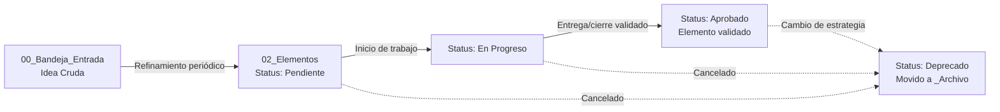
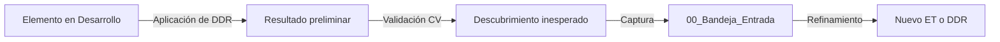

# Método DOMER – Sistema de Desarrollo y Gobernanza Documental (Versión Agnóstica)

> **DOMER** = **D**ocumentación **O**rganizada, **M**etódica, **E**volutiva y **R**astreable.
> Adaptación del manual original `SISTEMATIZACION.md` (pensado para software) a un método
> aplicable a **cualquier tipo de proyecto**: académico, de investigación, de negocio, creativo,
> de diseño o técnico. La esencia se conserva intacta: una bandeja de captura, notas formalizadas
> con metadatos, un ciclo de vida explícito, y un sistema de "ramas" (control de versiones o de
> avance) que conecta cada pieza de trabajo con su origen y su validación.
>
> Esta versión incorpora dos mejoras fundamentales para proyectos cuyo producto es conocimiento:
> el concepto de **Visión Activa** (documento rector que se versiona desde su nacimiento) y la
> sustitución de las Decisiones de Arquitectura por **Decisiones Metódicas (DDR)**, que reflejan
> los enfoques, métodos y protocolos que transforman datos en conclusiones.

---

## 1. Estructura del espacio de trabajo (`/proyecto`)

```text
proyecto/
├── 00_Bandeja_Entrada/     # Captura rápida de ideas, hallazgos o insumos sin procesar.
├── 01_Vision/              # Visión Activa (objetivo de conocimiento, pregunta central, guía de actividad).
├── 02_Elementos/           # Unidades de trabajo formalizadas: datos, análisis, resultados intermedios.
│   └── _Plantillas/        # Plantillas reutilizables de Elementos y Decisiones.
├── 03_Decisiones/          # Decisiones Metódicas (DDR): enfoques, métodos, protocolos.
├── 04_Ciclos/              # Planificación y producción cíclica. Cada ciclo contiene las ramas activas
│   ├── Ciclo-01/           #   o referencias al trabajo en curso (dominio/, metodo/, exploracion/).
│   │   ├── plan.md         #   Plan del ciclo: qué Elementos y DDRs se abordan.
│   │   ├── dominio/        #   Ramas de trabajo activas durante este ciclo.
│   │   ├── metodo/         #   Ramas de decisiones metódicas en implementación.
│   │   └── revision.md     #   Cierre del ciclo: qué se completó, qué se aprendió.
│   └── Ciclo-02/
├── 05_Validacion/          # Casos de validación, experimentos, pruebas de hipótesis, revisiones.
├── _Archivo/               # Notas obsoletas o deprecadas, conservadas por trazabilidad.
└── METODO_DOMER.md         # Este manual.
```

**Reglas de uso:**
- `00_Bandeja_Entrada/` no requiere estructura ni metadatos; aquí se vuelca cualquier idea, dato o insumo.
- `01_Vision/` contiene los documentos de Visión Activa (`VA-XXX`), que se versionan formalmente desde su creación (ver sección 2.1).
- `02_Elementos/` y `03_Decisiones/` solo contienen notas con frontmatter válido (ver sección 2).
- `04_Ciclos/` es el espacio de **planificación y producción**. Cada ciclo contiene:
  - Un archivo `plan.md` que detalla qué Elementos (ET-XXX) y Decisiones (DDR-XXX) se abordarán.
  - Las **ramas de trabajo activas** (si se usa Git) o **carpetas de trabajo** (si no se usa Git) donde se ejecuta el desarrollo real: `dominio/`, `metodo/`, `exploracion/`, etc. Estas ramas siguen la convención GitFlow descrita en la sección 7.
  - Un archivo `revision.md` que documenta el cierre del ciclo: entregables completados, lecciones aprendidas y ajustes para el siguiente ciclo.
- `_Archivo/` recibe las notas con `status: Deprecado` que ya no están activas pero no se eliminan.

> Esta estructura no exige una herramienta específica: puede vivir en Obsidian, en carpetas de
> Google Drive, en Notion o en cualquier gestor de notas con soporte de metadatos/etiquetas.

---

## 2. Estándar de metadatos (frontmatter)

Cada nota en `01_Vision/`, `02_Elementos/`, `03_Decisiones/` o `05_Validacion/` inicia con un bloque YAML.

### 2.1 Visión Activa (`01_Vision/VA-XXX.md`)

La Visión Activa es el documento que articula el propósito central del proyecto: la pregunta de conocimiento que se persigue, el fenómeno que se quiere comprender o la solución que se desea construir. **Nace directamente en `01_Vision/`**, con versionado explícito desde su primer borrador.

```yaml
---
tipo: vision_activa
id: VA-001
status: Borrador         # Borrador | Activa | Deprecada
version: 0.1             # Versionado semántico o incremental (0.1, 0.2, 1.0, 1.1, ...)
fecha_creacion: 2026-07-12
autores: "@persona"      # opcional
dominios_previstos:      # Áreas, disciplinas o ámbitos que se explorarán
  - "fenómeno óptico"
  - "modelado espectral"
---
```

**Criterios para crear una Visión Activa:**
- Existe una pregunta de conocimiento o un objetivo de indagación, aunque sea tentativo.
- Se ha expresado el *porqué* vale la pena perseguirlo.
- Se esbozan los primeros dominios o líneas de exploración (pueden ser vagos al inicio).

La Visión **se versiona** utilizando un sistema de control de versiones formal (Git o similar) o, si no se usa Git, mediante la propia numeración en el fichero (p. ej., `VA-001_v0.1.md`, `VA-001_v1.0.md`). La versión `1.0` marca el momento en que la Visión es lo suficientemente sólida como para guiar la planificación de Ciclos y la creación de Elementos y Decisiones.

### 2.2 Elemento de Trabajo (`02_Elementos/ET-XXX.md`)

```yaml
---
tipo: elemento
id: ET-001
status: Pendiente        # Pendiente | En Progreso | Aprobado | Deprecado
prioridad: Alta          # Crítica | Alta | Media | Baja
area: "Región Andina"    # Componente, región, materia, línea temática, etc.
origen: DDR-001          # Referencia a la Decisión Metódica que lo justifica
responsable: "@persona"  # opcional
ciclo: "Ciclo-01"        # Sprint / semana / fase en la que se trabaja
rama: "dominio/ET-001-nombre-corto-v1.0"  # opcional, ver sección 7
---
```

### 2.3 Decisión Metódica (`03_Decisiones/DDR-XXX.md`)

Las Decisiones Metódicas (DDR) documentan el *cómo*: qué enfoque, método, técnica o protocolo se elige para transformar datos o ideas en conocimiento validado.

```yaml
---
tipo: decision_metodica
id: DDR-001
status: Propuesta        # Propuesta | Aceptada | Superada
fecha: 2026-07-12
reemplaza: DDR-000         # si esta decisión sustituye a una anterior
superada_por:              # si otra decisión posterior la deja sin efecto
rama: "metodo/DDR-001-nombre-corto"  # opcional
elementos_derivados:       # Lista de ET-XXX que materializan esta decisión
  - ET-001
  - ET-002
---
```

### 2.4 Caso de Validación (`05_Validacion/CV-XXX.md`) (opcional)

```yaml
---
tipo: validacion
id: CV-001
status: Diseñado          # Diseñado | Preparado | Ejecutado | Fallido
elemento: ET-001
area: "Región Andina"
---
```

**Significado de los estados:**
- **Pendiente:** el elemento está refinado y listo para priorizarse y trabajarse.
- **En Progreso:** hay trabajo activo, discusión o construcción en curso.
- **Aprobado:** el trabajo se completó, cumple su definición de hecho y quedó validado.
- **Deprecado:** el elemento fue reemplazado, cancelado o quedó obsoleto; se mueve a `_Archivo/`.

---

## 3. Anatomía de una nota de Elemento

Cada Elemento debe responder al **por qué** y al **cómo se valida**, no solo describir una tarea.

```markdown
# [ET-001] Nombre Descriptivo del Elemento

## 🎯 1. El "Por Qué" (Contexto y Justificación)
*¿Qué problema o necesidad resuelve este elemento? ¿Por qué es necesario ahora mismo?*

## 👥 2. Actores y Alcance
*¿Quién se ve afectado o interviene? ¿Qué queda explícitamente fuera de este elemento?*

## 📋 3. Criterios de Cumplimiento (Definición de Hecho)
- [ ] Dado que [contexto inicial], cuando [acción], entonces [resultado esperado].
- [ ] ...

## ⚠️ 4. Notas de Implementación (Opcional)
*Supuestos, riesgos, dependencias o ideas sobre cómo abordarlo.*

## 🔗 5. Trazabilidad
*   **Decisión Metódica de origen (si aplica):** [[DDR-001]]
*   **Conversación/Insumo:** [Enlace o referencia]
*   **Entregable/Resultado:** [Enlace al producto final]
*   **Decisión Relacionada:** [[DDR-001]]
*   **Casos de Validación:** [[CV-001]], [[CV-002]]
```

**Definición de Listo (DoR)** para mover de `00_Bandeja_Entrada/` a `02_Elementos/`:
- Título descriptivo e identificador asignado.
- Al menos un párrafo en "El Por Qué" y un actor identificado.
- El `origen` está documentado (normalmente un DDR).
- Criterios de cumplimiento iniciales esbozados.

---

## 4. Ciclo de vida de una nota



### 4.1 Fases

1. **Captura:** cualquier persona anota ideas, hallazgos o insumos en `00_Bandeja_Entrada/`, sin formato exigido.
2. **Refinamiento (sesión periódica):** se revisa la bandeja; lo que cumple la DoR recibe un ID (`ET-XXX` o `DDR-XXX`), se le asigna el frontmatter completo y se mueve a `02_Elementos/` o `03_Decisiones/` con estado `Pendiente`.
3. **Desarrollo:** al iniciarse el trabajo, `status` pasa a `En Progreso`. Se crea la rama de trabajo correspondiente (siguiendo la convención GitFlow de la sección 7) dentro de la carpeta del ciclo activo (`04_Ciclos/Ciclo-XX/`), se abre el espacio de discusión (issue, hilo, reunión) y se enlaza en la trazabilidad. **El desarrollo real ocurre en estas ramas**, no en las notas estáticas de `02_Elementos/`.
4. **Consolidación:** al terminar, se marcan los criterios cumplidos, se fusiona la rama (o se cierra la carpeta de trabajo), se cambia `status` a `Aprobado` y se enlaza el entregable final.
5. **Deprecación:** si un Elemento deja de ser relevante, `status` pasa a `Deprecado`, se mueve a `_Archivo/` y se documenta el motivo.

### 4.2 Definición de Hecho (DoD) para `status: Aprobado`
- El entregable asociado está finalizado y accesible.
- Los criterios de cumplimiento están verificados.
- Los casos de validación relacionados (si existen) están `Ejecutado` y pasan correctamente.
- La nota está completamente actualizada y enlazada a su discusión y su entregable.

### 4.3 Relación entre Decisiones Metódicas y Elementos

La mayoría de los Elementos nacen de una Decisión Metódica. Un DDR puede desglosarse en **varios Elementos** que lo materializan en distintas partes del proyecto.

1. Se crea un DDR en `03_Decisiones/` con estado `Propuesta`.
2. Se redactan uno o más `ET-XXX` cuyo `origen` apunta al DDR.
3. Cada Elemento sigue su ciclo de vida independiente.
4. El DDR mantiene el campo `elementos_derivados` para trazabilidad inversa.
5. Cuando todos los Elementos derivados están `Aprobado`, la decisión metódica se considera implementada.

### 4.4 Bucle de realimentación: de la validación a la bandeja de entrada

En proyectos de construcción de conocimiento, la validación frecuentemente genera **nuevos descubrimientos** que no estaban previstos. Estos hallazgos (un patrón inesperado en los datos, una correlación no hipotetizada, una anomalía que requiere explicación) se vierten nuevamente en `00_Bandeja_Entrada/` como insumos frescos, cerrando el bucle de aprendizaje continuo:



---

## 5. Panel de control (automatización de vistas)

Si el gestor de notas soporta consultas dinámicas (p. ej. Dataview en Obsidian), se recomienda un
`Dashboard` central con vistas equivalentes:

```dataview
TABLE prioridad AS "Prioridad", area AS "Área", ciclo AS "Ciclo", responsable AS "Responsable"
FROM "02_Elementos"
WHERE tipo = "elemento" AND status = "En Progreso"
SORT prioridad ASC
```

```dataview
TABLE origen AS "Decisión Origen", status AS "Estado", prioridad AS "Prioridad"
FROM "02_Elementos"
WHERE tipo = "elemento" AND contains(origen, "DDR")
SORT origen ASC
```

Para quienes no utilicen Obsidian, el panel puede implementarse con cualquier herramienta de filtrado (etiquetas, vistas de base de datos, hojas de cálculo). Lo esencial es mantener visibles:
- Los Elementos activos agrupados por estado y prioridad.
- La relación entre DDRs y sus Elementos derivados.
- El estado de los Casos de Validación vinculados a cada Elemento.

---

## 6. Mantenimiento y evolución

- Este manual se versiona junto con el proyecto; cualquier cambio de metodología se refleja aquí.
- Las plantillas en `_Plantillas/` son el punto único de verdad del formato de las notas.
- Periódicamente se revisa `_Archivo/` y se depuran notas obsoletas sin valor histórico.
- Cuando un DDR se supera, se revisan los Elementos que apuntaban a él (`origen`) y se actualiza el enlace.
- La Visión Activa (`VA-XXX`) se versiona formalmente: cada revisión sustancial genera un nuevo archivo o commit, y la versión anterior se conserva en el histórico del sistema de control de versiones.

---

## 7. Integración con control de avance ("GitFlow" generalizado)

Si el proyecto usa Git (incluso para documentos, informes o datos) se recomiendan las siguientes convenciones de ramas. Si no se usa Git, el mismo esquema se traduce a **carpetas de trabajo con el mismo nombre**, cumpliendo la misma función de aislar y trazar cada pieza de trabajo.

| Tipo de rama/carpeta | Formato                              | Propósito                                                                 |
| --------------------- | ------------------------------------ | -------------------------------------------------------------------------- |
| `dominio/`            | `dominio/ET-XXX-<descripción>-vX.Y`  | Desarrollo de un Elemento específico. Enlaza con la nota en `02_Elementos/`. |
| `entrega/`            | `entrega/vX.Y.Z`                     | Entrega candidata; agrupa varios Elementos del ciclo.                       |
| `correccion/`         | `correccion/vX.Y.Z`                  | Corrección urgente sobre un entregable ya publicado.                        |
| `exploracion/`        | `exploracion/<tema>-<periodo>`       | Exploración o prototipado ligado a ideas de la Bandeja de Entrada.          |
| `metodo/`             | `metodo/DDR-XXX-<descripción>`       | Implementación de una Decisión Metódica documentada en `03_Decisiones/`.    |
| `vision/`             | `vision/VA-XXX-vX.Y`                 | Ramas dedicadas a la evolución de la Visión Activa (opcional).              |
| `main`                | `main`                               | Versión consolidada del proyecto / entregable oficial vigente.              |

**Reglas de integración:**
- Toda rama `dominio/` debe tener un `ET-XXX` asociado en `Pendiente` o `En Progreso`.
- Al crearla, se añade su nombre al campo `rama` del Elemento.
- Al fusionarla/cerrarla, se actualiza el Elemento: `status`, enlace al entregable, trazabilidad.
- Al consolidar una `entrega/`, todos los Elementos incluidos pasan a `Aprobado`.
- Las `exploracion/` viven idealmente un ciclo; si se formalizan, generan una rama `dominio/` nueva.
- Las `metodo/` se cierran cuando el DDR pasa a `Aceptada`.
- La Visión Activa se puede gestionar en una rama `vision/` o directamente en `main` a través de commits versionados que incrementan el número de versión.

---

## 8. Ejemplo de activación del método en un proyecto de investigación

A continuación se ilustra cómo se instancia el método DOMER en un proyecto típico de construcción de conocimiento, mostrando la trazabilidad completa desde la Visión hasta la validación.

### 8.1 Visión Activa (`01_Vision/VA-001.md`)

```yaml
---
tipo: vision_activa
id: VA-001
status: Activa
version: 1.0
fecha_creacion: 2026-07-12
autores: "@investigador"
dominios_previstos:
  - "fenómeno óptico atmosférico"
  - "análisis espectral"
  - "modelado de dispersión lumínica"
---

# Visión Activa: Comprender la formación del arco iris secundario

## Pregunta central
¿Qué condiciones atmosféricas y propiedades ópticas determinan la visibilidad
y las características del arco iris secundario tras una tormenta?

## Por qué
El arco iris secundario presenta inversión de colores y menor intensidad que
el primario. Aunque la óptica geométrica lo explica parcialmente, existen
variaciones observables en campo que no están completamente modeladas.

## Primeros pasos metodológicos (a refinar con DDRs)
- Recolectar datos de avistamientos (ubicación, hora, condiciones atmosféricas).
- Aplicar modelo de dispersión de Mie para gotas de agua.
- Contrastar predicciones del modelo con observaciones de campo.
```

### 8.2 Decisión Metódica (`03_Decisiones/DDR-001.md`)

```yaml
---
tipo: decision_metodica
id: DDR-001
status: Aceptada
fecha: 2026-07-12
rama: "metodo/DDR-001-modelo-mie"
elementos_derivados:
  - ET-001
  - ET-002
---

# DDR-001: Modelado de dispersión mediante teoría de Mie

## Contexto
Para explicar la inversión cromática del arco iris secundario se necesita un
modelo que vaya más allá de la óptica geométrica simple.

## Decisión
Utilizar la teoría de dispersión de Mie para modelar la interacción de la luz
solar con gotas de agua esféricas de distintos diámetros.

## Justificación
La teoría de Mie proporciona predicciones cuantitativas sobre la distribución
angular de la intensidad luminosa en función del tamaño de gota, permitiendo
simular tanto el arco primario como el secundario.

## Implicaciones
- Requiere recolectar datos de distribución de tamaño de gotas (ET-001).
- Requiere implementar o adaptar código de simulación (ET-002).
```

### 8.3 Elementos de trabajo

**`02_Elementos/ET-001.md`**

```yaml
---
tipo: elemento
id: ET-001
status: Aprobado
prioridad: Alta
area: "recolección de datos"
origen: DDR-001
ciclo: "Ciclo-01"
rama: "dominio/ET-001-datos-gotas-v1.0"
---

# [ET-001] Recolectar distribución de tamaño de gotas en tormentas

## 🎯 1. El "Por Qué"
El modelo de Mie requiere como entrada la distribución del diámetro de las gotas.
Sin estos datos, la simulación no puede contrastarse con la realidad.

## 👥 2. Actores y Alcance
- Equipo de campo con disdrómetro óptico.
- Fuera de alcance: eventos sin precipitación.

## 📋 3. Criterios de Cumplimiento
- [x] Dado que se registra una tormenta, cuando se despliega el disdrómetro, entonces se obtiene un espectro de gotas en intervalos de 5 minutos.
- [x] Los datos cubren al menos 5 tormentas con arco iris visible.

## 🔗 5. Trazabilidad
- **DDR de origen:** [[DDR-001]]
- **Entregable:** `datos/gotas_tormenta_2026-07.csv`
- **Casos de Validación:** [[CV-001]]
```

**`02_Elementos/ET-002.md`**

```yaml
---
tipo: elemento
id: ET-002
status: En Progreso
prioridad: Alta
area: "simulación óptica"
origen: DDR-001
ciclo: "Ciclo-01"
rama: "dominio/ET-002-simulacion-mie-v1.0"
---

# [ET-002] Implementar simulación de dispersión de Mie

## 🎯 1. El "Por Qué"
Se necesita una herramienta computacional que tome los datos de distribución
de gotas y genere las predicciones de intensidad angular para comparar con
los avistamientos de campo.

## 📋 3. Criterios de Cumplimiento
- [ ] Dado un espectro de gotas, cuando se ejecuta la simulación, entonces se obtiene un gráfico de intensidad vs. ángulo con picos en 42° y 51°.
- [ ] El código está documentado y versionado.

## 🔗 5. Trazabilidad
- **DDR de origen:** [[DDR-001]]
- **Repositorio:** [enlace al código]
- **Casos de Validación:** [[CV-002]]
```

### 8.4 Caso de Validación (`05_Validacion/CV-001.md`)

```yaml
---
tipo: validacion
id: CV-001
status: Ejecutado
elemento: ET-001
area: "recolección de datos"
---

# CV-001: Verificar integridad de datos de gotas

## Procedimiento
- Revisar que cada archivo de salida del disdrómetro contenga las columnas esperadas: timestamp, diámetro (mm), velocidad (m/s).
- Validar que no haya huecos temporales mayores a 10 minutos durante las tormentas registradas.

## Resultado
5 tormentas documentadas. Datos completos en el 94% de los intervalos. Se acepta.
```
