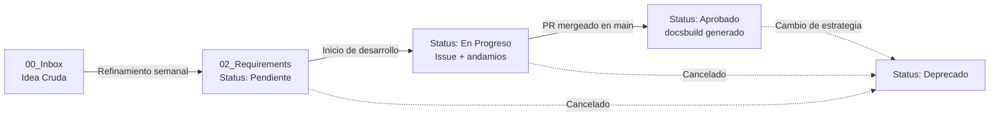
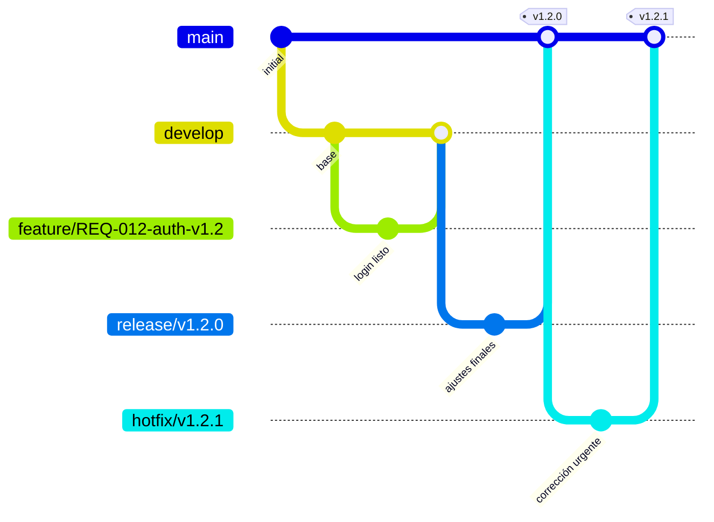

---
# Manual de Gobernanza de la Documentación Organizada, Metódica, Evolutiva y Rastreable DOMER

Todo proyecto empieza con una conversación, no con un documento. Alguien dice "probemos esto", otro responde "mejor así", y ahí queda la decisión — clara hoy, borrosa en tres meses, invisible para quien se sume el año que viene. El código sobrevive a esa conversación. La razón detrás del código, casi nunca.

Domer nace de esa asimetría, no de una vocación taxonómica. No pretende documentar todo — ese tipo de manual se abandona a las dos semanas, cuando el ritmo real del trabajo lo desborda. Pretende algo más terco y más pequeño: que ninguna decisión que vaya a importar dentro de un año se quede solo en la cabeza de quien la tomó hoy.

Domer no gobierna una identidad, gobierna un **método**: un ciclo de desarrollo que se documenta a sí mismo a medida que ocurre. Cada nota existe para responder una sola pregunta — _¿por qué se decidió esto?_ — y nada más. El cómo técnico se resuelve en el código; la referencia posterior a ese código se genera sola. Domer no compite con ninguna de las dos cosas, solo exige que ambas existan.

La metodología usa **Obsidian** y **GitHub** como núcleo del flujo de trabajo, y prioriza la trazabilidad del _porqué_ por encima de la documentación estática.

---

## 1. Segmentación del repositorio

```text
repo-root/
├── docs/          # Fuente de verdad de la gobernanza (visión, decisiones, requisitos, sprints).
├── software/      # Código fuente del producto.
├── build/         # Artefactos generados automáticamente, incluyendo docsbuild.
├── .github/       # Workflows de CI/CD, plantillas de Issues y Pull Requests.
└── README.md
```

**Regla de frontera `docs/` vs `build/`:**

> Si alguien tuvo que decidir conscientemente algo, pertenece a `docs/`. Si se puede derivar o regenerar automáticamente desde el código, pertenece a `build/`.

`build/` aloja **docsbuild**: la documentación de referencia del código, generada de forma automática a partir del propio código y sus comentarios. Domer exige que esta generación esté automatizada — ningún miembro del equipo la redacta a mano — pero no define su formato ni su contenido, porque no es una decisión: es un derivado. Domer solo deja constancia de que debe existir.

---

## 2. Estructura del directorio (`docs/`)

```text
docs/
├── 00_Inbox/            # Captura rápida de ideas, feedback sin procesar y notas de reuniones.
├── 01_Product/          # La identidad del producto.
│   ├── Vision/          # VA-XXX.md — la Visión Activa.
│   └── Dominios/        # <dominio>.md — identidad de un pilar, cuando lo comparte más de un ADR.
├── 02_Requirements/     # Requisitos (REQ-XXX) — la unidad de valor del sistema.
│   └── _Templates/      # Plantillas reutilizables de todas las notas.
├── 03_Architecture/     # Decisiones de Arquitectura (ADR-XXX) — único tipo de decisión.
├── 04_Sprints/          # Planificación cíclica, minutas y andamios temporales.
│   ├── Sprint-01/
│   └── Sprint-02/
├── 05_Testing/          # Casos de prueba (TC-XXX), planes de validación (opcional).
├── _Archive/            # Notas obsoletas o deprecadas que se conservan por trazabilidad.
└── SISTEMATIZACION.md   # Este manual.
```

**Reglas de uso:**

- `00_Inbox/` no requiere estructura; aquí se vuelca cualquier pensamiento.
- Todo lo que vive en `01_Product/` nace directamente ahí: la Visión Activa en `Vision/`, y los documentos de Dominio en `Dominios/`. El resto de las notas nace en `00_Inbox/`.
- `02_Requirements/`, `03_Architecture/` y `01_Product/Dominios/` solo contienen notas con frontmatter válido.
- `04_Sprints/` puede contener, además de las minutas habituales, **andamios**: notas temporales de planeación (sección 4.5).
- `_Archive/` recibe ADR superados y REQ deprecados del MVP, según la política de conservación (sección 11).

---

## 3. Jerarquía general del sistema

```text
Visión Activa (VA)  ── 1 ──────────► N  ADR   (03_Architecture — decisión técnica)
                                              │
                                            1 ──────► N  REQ   (02_Requirements — unidad de valor)
```

- **VA → ADR** es 1:N. Cada ADR tiene exactamente una `vision_origen`.
- **ADR → REQ** es 1:N. Cada REQ tiene exactamente un `origen`: un ADR.
- El **REQ es la unidad de valor** del sistema: es la nota más pequeña que domer obliga a rastrear hasta producción.
- Los **documentos de Dominio** (`01_Product/Dominios/`) no son un nivel de esta jerarquía: son material de identidad que un ADR cita por nombre en su campo `dominio`, útil cuando varios ADR comparten el mismo paradigma (sección 4.2).
- **Feature no es un tipo de nota gobernado por domer.** Conserva su significado habitual de la industria — una funcionalidad del producto —, sin ninguna redefinición. La planeación de bajo nivel que antecede a construir una pieza de un REQ ocurre en **andamios** (sección 4.5): apoyos temporales, no una capa jerárquica del sistema.

---

## 4. Estándar de Metadatos (Propiedades Frontmatter)

### 4.1 Visión Activa (`01_Product/Vision/VA-XXX.md`)

```yaml
---
tipo: vision
id: VA-XXX
status: Borrador          # Borrador | Activa | Superada
naturaleza:                # libre, opcional — p.ej. Comercial, Herramienta, Hipótesis-solución
---
```

**Cuerpo mínimo para `status: Activa`:** qué es y cómo se usa, qué no es, y opcionalmente alternativas cercanas.

### 4.2 Documento de Dominio (`01_Product/Dominios/<dominio>.md`)

```yaml
---
tipo: dominio
dominio: "Mensajería"       # nombre del dominio; funciona como identificador
status: Propuesto           # Propuesto | En Delimitación | Delimitado
vision_origen: VA-XXX
---
```

**Estados:**

- **Propuesto:** se identificó que este dominio va a sostener más de una decisión técnica, pero todavía no se delimita.
- **En Delimitación:** se está redactando qué es y qué no es este dominio dentro del producto.
- **Delimitado:** el documento distingue con claridad el pilar; los ADR pueden apoyarse en él con confianza.

Se crea **solo cuando un dominio va a sostener más de un ADR**. Si un ADR es el único que existirá en su dominio, su propia sección de Contexto (4.3) alcanza y no hace falta este documento. **Cuerpo mínimo para `Delimitado`:** qué es este dominio dentro del producto, qué no es.

### 4.3 Decisión de Arquitectura (`03_Architecture/ADR-XXX.md`)

```yaml
---
tipo: adr
id: ADR-XXX
status: Propuesto          # Propuesto | Aceptado | Superado
fecha: YYYY-MM-DD
vision_origen: VA-XXX
dominio: "Nombre del pilar"  # obligatorio; enlaza al documento de Dominio si existe
reemplaza: ADR-000
superado_por:
requisitos_derivados:
  - REQ-XXX
rama: "adr/ADR-XXX-descripcion"
---
```

Cada ADR resuelve **paradigma y tecnología en el mismo documento**: su cuerpo abre con una sección de **Contexto** que argumenta la forma elegida (el método) antes de entrar en la decisión técnica concreta. Cuando ese contexto ya está delimitado en un documento de Dominio compartido, el ADR puede remitirse a él en vez de repetirlo.

### 4.4 Requisito (`02_Requirements/REQ-XXX.md`)

```yaml
---
tipo: requisito
id: REQ-XXX
status: Pendiente          # Pendiente | En Progreso | Aprobado | Deprecado
prioridad: Alta            # Crítica | Alta | Media | Baja
modulo: Core
origen: ADR-XXX
responsable: "@usuario"
sprint: "Sprint-03"
rama: "feature/REQ-XXX-descripcion-vX.Y"
---
```

**Estados:**

- **Pendiente:** refinado, listo para desarrollarse.
- **En Progreso:** hay un Issue/PR activo; pueden existir andamios de apoyo en el sprint.
- **Aprobado:** el PR fue fusionado en `main`, los criterios están verificados.
- **Deprecado:** cancelado o reemplazado; se mueve a `_Archive/` según la política de conservación.

### 4.5 Andamio (`04_Sprints/Sprint-XX/AND-XXX.md`)

```yaml
---
tipo: andamio
id: AND-XXX
requisito: REQ-XXX
decisiones:                 # ADR que informan el enfoque
  - ADR-XXX
---
```

Un andamio es el lienzo donde se deja escrita la deducción concreta que precede a construir una pieza de un REQ: _dado que existe este requisito, con estas decisiones relacionadas, se emplea tal enfoque_. No tiene ciclo de estados ni rama propia — vive y muere dentro del sprint que lo motivó. Una vez construido lo que guiaba, se elimina del vault (queda en el historial de Git, nunca se archiva).

### 4.6 Caso de Prueba (`05_Testing/TC-XXX.md`) (opcional)

```yaml
---
tipo: test-case
id: TC-XXX
status: Diseñado           # Diseñado | Automatizado | Ejecutado | Fallido
requisito: REQ-XXX
modulo: Core
---
```

---

## 5. Definición de Listo (DoR) y Definición de Hecho (DoD)

### 5.1 VA

**DoR para `Activa`:** contiene "qué es", "qué no es" y, opcionalmente, alternativas. No tiene DoD; se supera cuando otra VA la reemplaza.

### 5.2 Documento de Dominio

**DoR para `Delimitado`:** `vision_origen` apunta a una VA Activa; contiene qué es y qué no es el dominio. No tiene DoD formal — se edita directamente cuando el pilar evoluciona, igual que la VA.

### 5.3 ADR

**DoR:** `vision_origen` apunta a una VA Activa; sección de Contexto (método) redactada; al menos una alternativa evaluada. **DoD (`Aceptado`):** discusión de equipo sin objeciones abiertas.

### 5.4 REQ

**DoR:** título descriptivo, actor identificado, al menos un párrafo en "El Porqué", `origen` (un ADR), criterios de aceptación esbozados. **DoD (`Aprobado`):** código fusionado en `main`, criterios de aceptación verificados, casos de prueba relacionados en `Ejecutado` si existen.

### 5.5 Andamio

**DoR:** existe un REQ y al menos un ADR relacionado identificado — _dado que existe este REQ, con estas decisiones, se emplea..._ **Fin de uso:** se elimina en cuanto lo que guiaba queda construido, o al cerrar el sprint que lo contiene.

---

## 6. Anatomía de las notas

### 6.1 Nota de Requisito

```markdown
# [REQ-XXX] Nombre Descriptivo del Requisito

## 🎯 1. El "Por Qué"
*¿Qué problema resuelve? ¿Por qué es necesario ahora?*

## 👥 2. Actores y Alcance
*¿Quién interactúa con esta funcionalidad? ¿Qué queda explícitamente fuera?*

## 📋 3. Criterios de Aceptación
- [ ] Dado que [contexto inicial], cuando [acción], entonces [resultado esperado].

## 🔗 4. Trazabilidad
*   **Origen:** [[ADR-XXX]]
*   **Decisiones relacionadas:** [[ADR-YYY]] (si informan, no originan)
*   **Casos de Prueba:** [[TC-XXX]]
*   **Implementación:** [Enlace al Pull Request]
```

### 6.2 Nota de Andamio

```markdown
# [AND-XXX] Nombre corto del andamio

Dado que existe [[REQ-XXX]], con [[ADR-XXX]] relacionada, se emplea...

*(lo que se deduce, lo que se concluye: la decisión concreta para construir esta pieza)*
```

---

## 7. Ciclo de Vida de una Nota



1. **Captura (Inbox):** cualquier persona anota ideas, feedback o conclusiones de reuniones. No se exige formato.
2. **Refinamiento (sesión semanal):** las notas que cumplen su DoR reciben un ID único y se mueven a su carpeta (`03_Architecture` o `02_Requirements`) con estado inicial `Propuesto`/`Pendiente`.
3. **Desarrollo:** al iniciar trabajo sobre un REQ, su `status` pasa a `En Progreso`, se abre un Issue y se crea la rama `feature/`. Si el requisito lo amerita, se crean andamios dentro de `04_Sprints/Sprint-XX/` que dejan escrito el razonamiento de construcción.
4. **Consolidación:** al fusionar el PR en `main`, el REQ pasa a `Aprobado`, sus criterios quedan marcados, los andamios que lo guiaron se eliminan del vault, y se dispara la generación automática de docsbuild en `build/`.
5. **Deprecación:** si un REQ deja de ser relevante, su `status` pasa a `Deprecado` y se procesa según la sección 11. Un ADR superado sigue la misma lógica: `status: Superado` y enlace `superado_por`.

---

## 8. Integración con GitFlow

### 8.1 Convención de nombres de rama

|Tipo de rama|Formato|Propósito|
|---|---|---|
|`feature/`|`feature/REQ-XXX-<descripción>-vX.Y`|Desarrollo de un requisito específico.|
|`release/`|`release/vX.Y.Z`|Candidata a producción; agrupa varios requisitos del sprint.|
|`hotfix/`|`hotfix/vX.Y.Z`|Corrección urgente sobre `main`.|
|`spike/`|`spike/<tema>-<semana>`|Experimentación ligada a ideas de `00_Inbox/`.|
|`adr/`|`adr/ADR-XXX-<descripción>`|Discusión e implementación de una decisión de arquitectura.|
|`main`|`main`|Código en producción. Solo requisitos en `Aprobado`.|

### 8.2 Reglas de integración

- Toda rama `feature/` debe tener un `REQ-XXX` asociado en estado `Pendiente` o `En Progreso`. Si no existe el requisito, no se crea la rama.
- Al crear la rama, se añade su nombre al campo `rama` del requisito.
- Al fusionar una `feature/` en `develop` (o en `release/`), se actualiza la nota de requisito: se marca `status: En Progreso` si aún no lo estaba, y se enlaza el Pull Request.
- Al fusionar una `release/` en `main`, todos los requisitos incluidos pasan a `status: Aprobado`, se completa su DoD y se dispara la generación de docsbuild.
- Las ramas `spike/` viven máximo un sprint. Si el experimento se convierte en requisito, se crea una `feature/` desde `develop` y la spike se elimina. Nunca se fusiona una spike directamente a `main`.
- **Hotfix:** los hotfixes se crean desde `main`. Tras la fusión, la nota del requisito relacionado (si existe) refleja la corrección en su trazabilidad. Si no hay requisito previo, se crea uno retroactivamente con `status: Aprobado` y `origen: hotfix/vX.Y.Z`.
- Las ramas `adr/` se tratan como discusión de decisión: su Issue y PR se vinculan a la nota correspondiente. Al fusionarse, el ADR pasa a `Aceptado`. Si genera varios requisitos, cada uno tiene su propia rama `feature/REQ-XXX-...` independiente.
- Los andamios no tienen rama propia: viven como archivos dentro de `04_Sprints/Sprint-XX/`, se versionan junto con el trabajo del sprint y se eliminan al concluir su propósito.

### 8.3 Flujo completo con ejemplo

Supongamos el requisito `REQ-012` (Autenticación de usuarios), planificado para la versión 1.2.0 en el Sprint-03, con origen en `ADR-003`. `ADR-003` comparte el dominio "Autenticación" con `ADR-004`, por lo que existe `01_Product/Dominios/autenticacion.md` en estado `Delimitado`.

1. **Refinamiento:** `REQ-012.md` se mueve a `02_Requirements/` con `status: Pendiente` y `origen: ADR-003`.
2. **Inicio de desarrollo:** `status: En Progreso`, `sprint: Sprint-03`, se abre el Issue y se crea `feature/REQ-012-auth-v1.2`.
3. **Andamios de apoyo:** en `04_Sprints/Sprint-03/` se crean `AND-020` (UI de login) y `AND-021` (backend de autenticación), cada uno enlazando `REQ-012` y `ADR-003` con la conclusión concreta de diseño para esa pieza.
4. **Consolidación:** el PR se fusiona en `main`. `REQ-012` pasa a `status: Aprobado`, sus criterios quedan marcados, `AND-020` y `AND-021` se eliminan del vault, y se genera automáticamente la documentación del código en `build/`.
5. **Hotfix:** semanas después aparece un error en el login. Se crea `hotfix/v1.2.1` desde `main`; tras la fusión, se añade una mención en la trazabilidad de `REQ-012`.

### 8.4 Mapeo visual del flujo de ramas



---

## 9. Automatización de Vistas (Cuadro de Mando)

````markdown
# 📊 Panel de Control del Proyecto

## 🌱 Visión Activa vigente
```dataview
TABLE status AS "Estado", naturaleza AS "Naturaleza"
FROM "01_Product/Vision"
WHERE tipo = "vision" AND status = "Activa"
```

## 🧱 Documentos de Dominio
```dataview
TABLE status AS "Estado", vision_origen AS "Visión"
FROM "01_Product/Dominios"
WHERE tipo = "dominio"
```

## 🏗️ Decisiones de Arquitectura pendientes de aprobación
```dataview
TABLE dominio AS "Dominio", fecha AS "Fecha propuesta"
FROM "03_Architecture"
WHERE tipo = "adr" AND status = "Propuesto"
SORT fecha DESC
```

## 📋 Backlog (Requisitos Pendientes)
```dataview
TABLE prioridad AS "Prioridad", modulo AS "Módulo", origen AS "Origen"
FROM "02_Requirements"
WHERE tipo = "requisito" AND status = "Pendiente"
SORT prioridad ASC
```

## 🟡 Requisitos en Progreso
```dataview
TABLE modulo AS "Módulo", rama AS "Rama", responsable AS "Responsable"
FROM "02_Requirements"
WHERE tipo = "requisito" AND status = "En Progreso"
```

## 🪜 Andamios activos
```dataview
TABLE requisito AS "Requisito", decisiones AS "Decisiones"
FROM "04_Sprints"
WHERE tipo = "andamio"
```
````

---

## 10. Mantenimiento y Evolución del Sistema

- Este manual se versiona junto con el código; cualquier cambio en la metodología se refleja aquí.
- Las plantillas en `02_Requirements/_Templates/` son el punto único de verdad para el formato de todas las notas.
- Trimestralmente se revisa `_Archive/` y se aplica la política de conservación (sección 11).
- Cuando un ADR se supera, se revisa el campo `origen` de los REQ que apuntaban a él y se actualiza en consecuencia.

---

## 11. Política de Conservación de Artefactos

### 11.1 Visión Activa (VA)

Se versiona con Git, no se deprecia. No se mueve a `_Archive/`; si evoluciona, se crea una nueva nota en `01_Product/Vision/` y la anterior permanece en el historial.

### 11.2 Documentos de Dominio

Mismo tratamiento que la VA: no se archivan, se editan directamente cuando el pilar evoluciona, y quedan versionados en Git.

### 11.3 Decisiones de Arquitectura (ADR)

Se conservan siempre: cualquiera que herede el sistema necesita entender la tecnología elegida, incluso superada. Las activas viven en `03_Architecture/`; las superadas se mueven a `_Archive/` con `superado_por` enlazado. No se eliminan.

### 11.4 Requisitos (REQ)

Un REQ vigente nunca se elimina del vault activo. Al deprecarse:

- **REQ del MVP:** se mueven a `_Archive/` — preservan el _qué_ mínimo del sistema.
- **Resto de REQ:** se eliminan del vault, quedando su historial en Git. El equipo puede archivarlos a discreción si tienen valor histórico excepcional, pero por defecto no se conservan.

### 11.5 Andamios

Son artefactos efímeros de planeación. Se eliminan del vault en cuanto cumplen su propósito — el REQ que guiaban se aprueba, o se cierra el sprint que los contiene. No se archivan: no representan conocimiento duradero, solo orientaron la construcción. Quedan en el historial de Git.

### 11.6 Documentación automática de código (docsbuild)

Vive en `build/`, no en `docs/`. Se genera desde el código y sus comentarios; su automatización es obligatoria, pero domer no la redacta ni la gobierna como nota — no responde al _porqué_, sino al _qué hay hoy en el código_.

### 11.7 Ramas de Git

Se mantiene la convención `feature/REQ-XXX-<descripción>-vX.Y`: el REQ es el núcleo que da identidad al trabajo de código. Los andamios no tienen rama propia.