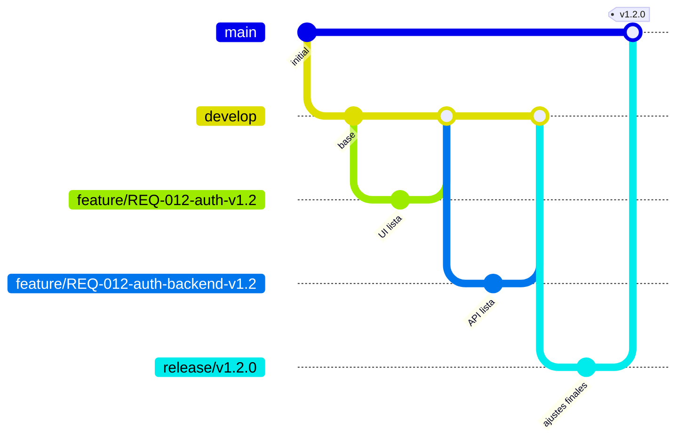

# Manual de Gobernanza de la Documentación

Este documento establece el estándar oficial para la captura, organización y evolución de la visión de producto, las decisiones técnicas, los requisitos y las piezas de planificación de bajo nivel dentro de este repositorio, utilizando **Obsidian** y **GitHub** como núcleo del flujo de trabajo.

La metodología prioriza la trazabilidad del *porqué* por encima de la documentación estática, pero mantiene la simplicidad de la versión 2.2.0. Incorpora la **Visión Activa** como semilla del sistema y las **Features** como lienzos de planeación que aterrizan los requisitos en trabajo concreto, sin forzar vínculos a PRs futuros y respetando la filosofía original de conservación mínima.

---

## 1. Segmentación del repositorio

El repositorio se organiza en áreas de responsabilidad clara. Solo se gobiernan los contenidos dentro de `docs/`; el resto sigue las convenciones del proyecto.

```text
repo-root/
├── docs/          # Fuente de verdad de la gobernanza (visión, requisitos, decisiones, features).
├── software/      # Código fuente del producto.
├── build/         # Artefactos generados automáticamente (referencias técnicas, esquemas, etc.).
├── .github/       # Workflows de CI/CD, plantillas de Issues y Pull Requests.
└── README.md
```

**Regla de frontera `docs/` vs `build/`:**
> Si alguien tuvo que decidir conscientemente algo, pertenece a `docs/`. Si se puede derivar o regenerar automáticamente desde el código, pertenece a `build/`.

---

## 2. Estructura del directorio (`docs/`)

```text
docs/
├── 00_Inbox/            # Captura rápida de ideas, feedback sin procesar y notas de reuniones.
├── 01_Product/          # Visión de negocio, roadmaps, alcance, usuarios objetivo.
│   └── Vision/          # VA-XXX.md — la Visión Activa, única nota que no nace en Inbox.
├── 02_Requirements/     # Requisitos de alto nivel (REQ-XXX).
│   └── _Templates/      # Plantillas reutilizables de todas las notas.
├── 03_Architecture/     # Decisiones de Arquitectura (ADR-XXX) y Decisiones Metódicas (MDR-XXX).
├── 04_Features/         # Elementos de planeación de bajo nivel (FEAT-XXX).
├── 05_Sprints/          # Planificación cíclica, minutas y revisiones.
│   ├── Sprint-01/
│   └── Sprint-02/
├── 06_Testing/          # Casos de prueba (TC-XXX), planes de validación (opcional).
├── _Archive/            # Notas obsoletas o deprecadas que se conservan por trazabilidad.
└── SISTEMATIZACION.md   # Este manual.
```

**Reglas de uso:**
- `00_Inbox/` no requiere estructura; aquí se vuelca cualquier pensamiento.
- Toda nota nace en `00_Inbox/`, excepto la Visión Activa (VA). La VA es la semilla del sistema y se crea directamente en `01_Product/Vision/`.
- Las carpetas `02_Requirements/`, `03_Architecture/` y `04_Features/` solo contienen notas con frontmatter válido.
- `03_Architecture/` alberga tanto ADR como MDR, con numeración independiente (`ADR-001`, `MDR-001`).
- `_Archive/` recibe notas con `status: Deprecado` o `Superada` que ya no están activas, según la política de conservación (ver sección 11).

---

## 3. Jerarquía general del sistema

```text
Visión Activa (VA)  ── 1 ──────────► N  MDR / ADR
                                            │
                                          1 ──────► N  REQ
                                                          │
                                                       1 ◄──────► M  FEATURE
```

- **VA → MDR/ADR** es 1:N. Cada MDR/ADR tiene exactamente una `vision_origen`.
- **MDR/ADR → REQ** es 1:N. Cada REQ tiene exactamente un `origen` (ADR o MDR).
- **REQ ↔ FEATURE** es N:M. Una Feature puede materializar varios REQ, y un REQ puede descomponerse en varias Features. Esta es la única relación de composición del sistema.

---

## 4. Estándar de Metadatos (Propiedades Frontmatter)

### 4.1 Visión Activa (`01_Product/Vision/VA-XXX.md`)

```yaml
---
tipo: vision
id: VA-XXX
status: Borrador          # Borrador | Activa | Superada
naturaleza:               # libre, opcional — p.ej. Comercial, Herramienta, Hipótesis-solución
alternativas_evaluadas: false
---
```

**Cuerpo mínimo para `status: Activa`:**
- **Qué es y cómo se usa** — un bloque que puede incluir el método.
- **Lo que no es** — límites explícitos del producto.
- **Alternativas cercanas** — opcional, señal de madurez.

### 4.2 Decisión Metódica (`03_Architecture/MDR-XXX.md`)

```yaml
---
tipo: mdr
id: MDR-XXX
status: Propuesta         # Propuesta | Aceptada | Superada
fecha: YYYY-MM-DD
vision_origen: VA-XXX
dominio:                  # opcional (pilar de la visión)
reemplaza: MDR-000
superada_por:
rama: "mdr/MDR-XXX-descripcion"
---
```

### 4.3 Decisión de Arquitectura (`03_Architecture/ADR-XXX.md`)

```yaml
---
tipo: adr
id: ADR-XXX
status: Propuesto         # Propuesto | Aceptado | Superado
fecha: YYYY-MM-DD
vision_origen: VA-XXX
dominio: "Nombre del pilar"  # obligatorio en ADR
reemplaza: ADR-000
superado_por:
rama: "adr/ADR-XXX-descripcion"
requisitos_derivados:
  - REQ-XXX
---
```

**Criterio MDR vs ADR:**  
MDR decide la **forma o paradigma** de la solución (todavía habla el lenguaje de la Visión).  
ADR decide la **tecnología concreta** que materializa esa forma.

### 4.4 Requisito (`02_Requirements/REQ-XXX.md`)

```yaml
---
tipo: requisito
id: REQ-XXX
status: Pendiente         # Pendiente | En Planificación | Planificado | Deprecado
prioridad: Alta           # Crítica | Alta | Media | Baja
modulo: Core
origen: ADR-XXX            # o MDR-XXX — exactamente UNA decisión
responsable: "@usuario"
sprint: "Sprint-03"
---
```

**Estados del requisito:**
- **Pendiente:** Refinado, listo para ser planificado.
- **En Planificación:** Se están diseñando sus Features hijas.
- **Planificado:** Todas sus Features están en estado `Aprobado` (diseño aprobado).
- **Deprecado:** Cancelado o reemplazado.

### 4.5 Feature (`04_Features/FEAT-XXX.md`)

```yaml
---
tipo: feature
id: FEAT-XXX
status: Pendiente         # Pendiente | En Diseño | Aprobado | Deprecado
requisitos:               # lista de REQ que materializa
  - REQ-XXX
  - REQ-YYY
responsable: "@usuario"
---
```

**Estados de la Feature:**
- **Pendiente:** Identificada en el backlog, espera ser diseñada.
- **En Diseño:** El desarrollador está elaborando la especificación de diseño.
- **Aprobado:** La especificación de diseño está completa y alineada con VA, MDR y ADR.
- **Deprecado:** Cancelada.

La Feature es un **lienzo de planeación**. Su función es obligar al desarrollador a revisar la VA, los MDR y los ADR que aplican, y plasmar una solución concreta que no rompa la identidad ni introduzca anti-patrones.  
**No se exige** que el código esté implementado para alcanzar `Aprobado`, ni se le asigna una rama propia. Las Features no tienen campo `rama` porque son artefactos de diseño, no de ejecución. La implementación se ramifica desde el REQ (ver sección 8).

### 4.6 Caso de Prueba (`06_Testing/TC-XXX.md`) (opcional)

```yaml
---
tipo: test-case
id: TC-XXX
status: Diseñado          # Diseñado | Automatizado | Ejecutado | Fallido
feature: FEAT-XXX
modulo: Core
---
```

---

## 5. Definición de Listo (DoR) y Definición de Hecho (DoD) por tipo

### 5.1 VA — Visión Activa
**DoR para `Activa`:** contiene "qué es", "qué no es" y, opcionalmente, alternativas.  
No tiene DoD; se supera cuando otra VA la reemplaza.

### 5.2 MDR / ADR
**DoR (Inbox → `03_Architecture/`):**
- `vision_origen` apunta a VA Activa.
- Justificación redactada.
- Para ADR: al menos una alternativa evaluada.

**DoD (`Aceptada`/`Aceptado`):** discusión de equipo sin objeciones abiertas.

### 5.3 REQ — Requisito
**DoR (Inbox → `02_Requirements/`):**
- Título descriptivo, actor identificado, al menos un párrafo en "El Por Qué".
- `origen` único (ADR o MDR).
- Criterios de aceptación iniciales esbozados.

**DoD (`Planificado`):**
- Todas las Features que lo referencian en su campo `requisitos` están en `Aprobado`.
- Los criterios de aceptación están verificables (aunque no ejecutados).

### 5.4 FEATURE — Elemento de planeación
**DoR (Inbox → `04_Features/`):**
- Al menos un REQ en el campo `requisitos`.
- Alcance ejecutable claro.

**DoD (`Aprobado`):**
- La especificación de diseño está redactada (ver sección 6.2).
- Se ha verificado que la solución propuesta es coherente con la VA, los MDR y los ADR correspondientes.
- El diseño está revisado por el equipo (no hay objeciones abiertas).

> **Nota sobre el PR:** El enlace al Pull Request NO forma parte de la Definición de Hecho. La Feature es un artefacto de planeación; la implementación y su trazabilidad se gestionan en el repositorio de código mediante las ramas basadas en REQ. La Feature no tiene rama asociada porque su valor se agota en el diseño.

---

## 6. Anatomía de las notas

### 6.1 Nota de Requisito

```markdown
# [REQ-XXX] Nombre Descriptivo del Requisito

## 🎯 1. El "Por Qué"
*¿Qué problema técnico o de negocio resuelve? ¿Por qué es necesario ahora?*

## 👥 2. Actores y Alcance
*¿Quién interactúa con esta funcionalidad? ¿Qué queda explícitamente fuera?*

## 📋 3. Criterios de Aceptación
- [ ] Dado que [contexto inicial], cuando [acción], entonces [resultado esperado].

## ⚠️ 4. Notas Técnicas Preliminares (Opcional)

## 🔗 5. Trazabilidad
*   **Origen (ADR o MDR):** [[ADR-XXX]] o [[MDR-XXX]]
*   **Decisiones relacionadas:** [[ADR-YYY]] (si informan, no originan)
*   **Features que lo materializan:** [[FEAT-XXX]], [[FEAT-YYY]]
```

### 6.2 Nota de Feature

```markdown
# [FEAT-XXX] Nombre Descriptivo de la Feature

## 🎯 1. Por Qué
*Qué necesidad de los REQ de origen resuelve esta pieza concreta.*

## 🛠️ 2. Especificación de Diseño
*Estructura, categorías, decisiones de forma que el programador debe seguir.
Aquí se revisan explícitamente la VA, los MDR y los ADR aplicables, y se argumenta cómo la solución propuesta respeta esa identidad y esas decisiones.*

## 📋 3. Criterios de Cumplimiento
- [ ] Dado que [contexto], cuando [acción], entonces [resultado esperado].

## 🔗 4. Trazabilidad
*   **Requisitos que materializa:** [[REQ-XXX]], [[REQ-YYY]]
*   **Casos de Prueba (si los hay):** [[TC-XXX]]
```

---

## 7. Ciclo de Vida de una Nota (El Flujo de Trabajo)


**Fases:**
1. **Semilla (VA):** se crea directamente en `01_Product/Vision/`.
2. **Captura (Inbox):** todo lo demás nace en `00_Inbox/`.
3. **Refinamiento:** se clasifica, se asigna ID y se mueve a su carpeta si cumple la DoR.
4. **Diseño (Feature):** el desarrollador elabora la especificación de diseño en la Feature, verificando VA, MDR y ADR.
5. **Planificación completada (REQ):** cuando todas sus Features están `Aprobado`, el REQ pasa a `Planificado`. La implementación de código puede comenzar en ese momento, guiada por las Features.
6. **Deprecación:** según la política de conservación (ver sección 11).

---

## 8. Integración con GitFlow

### 8.1 Convención de nombres de rama

| Tipo de rama | Formato | Propósito |
| --- | --- | --- |
| `feature/` | `feature/REQ-XXX-<descripción>-vX.Y` | Desarrollo de un requisito específico. |
| `release/` | `release/vX.Y.Z` | Candidata a producción. |
| `hotfix/` | `hotfix/vX.Y.Z` | Corrección urgente sobre `main`. |
| `spike/` | `spike/<tema>-<semana>` | Experimentación ligada a ideas de `00_Inbox/`. |
| `adr/` | `adr/ADR-XXX-<descripción>` | Discusión/prototipo de una decisión arquitectónica. |
| `mdr/` | `mdr/MDR-XXX-<descripción>` | Discusión/prototipo de una decisión metódica. |
| `main` | `main` | Código en producción. |

### 8.2 Reglas de integración

- Cada rama `feature/` debe tener un `REQ-XXX` asociado. La rama se crea cuando el REQ está en estado `Planificado` (todas sus Features aprobadas). El campo `rama` en el REQ (si se desea mantener) se completa al crear la rama.
- Las Features asociadas al REQ sirven como especificación de diseño durante el desarrollo. Se referencian en el cuerpo del REQ y en los commits.
- Al fusionar una `feature/` en `develop` (o en `release/`), el desarrollo del REQ se considera implementado.
- Al fusionar una `release/` en `main`, el REQ puede considerarse entregado. El equipo decide si actualiza el estado del REQ a un valor adicional como `Entregado` o lo mantiene en `Planificado` como indicador de diseño completo e implementación en producción.
- Las ramas `spike/`, `adr/` y `mdr/` siguen la misma lógica, sin requisitos de PR enlazados a notas.
- Las ramas `feature/` no se vinculan a FEAT: la Feature es un artefacto de planeación sin correspondencia directa con ramas.

**El núcleo de identidad de cada sprint sigue siendo el requisito (REQ).** En la planificación del sprint se seleccionan uno o varios REQ en estado `Pendiente` o `En Planificación`, y se crean las Features necesarias para ese sprint. Una vez que las Features están aprobadas y el REQ pasa a `Planificado`, se crea la rama `feature/REQ-XXX-...` para implementar.

### 8.3 Flujo completo con ejemplo

Supongamos el requisito `REQ-012` (Autenticación de usuarios) planificado para la versión 1.2.0, en el Sprint-03, y que deriva de `ADR-003`.

1. **Refinamiento:** La nota `REQ-012.md` se mueve a `02_Requirements/` con `status: Pendiente` y `origen: ADR-003`.
2. **Planificación del sprint:** Se asigna `sprint: Sprint-03`, `status: En Planificación`. Se crean las Features necesarias (por ejemplo, `FEAT-020` para la UI de login y `FEAT-021` para el backend de autenticación).
3. **Diseño:** Los desarrolladores trabajan en `FEAT-020` y `FEAT-021`, revisando la VA, los MDR y los ADR aplicables. Cuando el diseño está aprobado, las Features pasan a `Aprobado`.
4. **REQ Planificado:** Al estar todas sus Features en `Aprobado`, `REQ-012` pasa a `status: Planificado`. Se crea la rama de desarrollo:
   - `feature/REQ-012-auth-v1.2`
5. **Desarrollo:** El desarrollador usa `FEAT-020` y `FEAT-021` como guía de diseño mientras codifica en la rama `feature/REQ-012-auth-v1.2`.
6. **Cierre:** La rama se fusiona en `develop` y luego en `release/v1.2.0`. Al fusionar en `main`, el REQ se considera entregado. Las Features se eliminan del vault (ver sección 11).

### 8.4 Mapeo visual del flujo de ramas



*Nota: El requisito REQ-012 se desglosó en las Features FEAT-020 y FEAT-021, que sirvieron de lienzo de diseño pero no tienen rama propia. Las ramas reflejan el trabajo a nivel de requisito.*

---

## 9. Automatización de Vistas (Cuadro de Mando)

```markdown
# 📊 Panel de Control del Proyecto

## 🌱 Visión Activa vigente
` ` `dataview
TABLE status AS "Estado", naturaleza AS "Naturaleza"
FROM "01_Product/Vision"
WHERE tipo = "vision" AND status = "Activa"
` ` `

## 🏗️ Decisiones (ADR + MDR) pendientes de aprobación
` ` `dataview
TABLE tipo AS "Tipo", dominio AS "Dominio", fecha AS "Fecha"
FROM "03_Architecture"
WHERE (status = "Propuesto" OR status = "Propuesta")
SORT fecha DESC
` ` `

## 📋 Backlog de Requisitos
` ` `dataview
---
tipo: gobernanza
id: GOV-001
version: 2.3.0
ultima_revision: 2026-07-28
reemplaza: GOV-001 v2.2.0
---

# Manual de Gobernanza de la Documentación

Este documento establece el estándar oficial para la captura, organización y evolución de la visión de producto, las decisiones técnicas, los requisitos y las piezas de planificación de bajo nivel dentro de este repositorio, utilizando **Obsidian** y **GitHub** como núcleo del flujo de trabajo.

La metodología prioriza la trazabilidad del *porqué* por encima de la documentación estática, pero mantiene la simplicidad de la versión 2.2.0. Incorpora la **Visión Activa** como semilla del sistema y las **Features** como lienzos de planeación que aterrizan los requisitos en trabajo concreto, sin forzar vínculos a PRs futuros y respetando la filosofía original de conservación mínima.

---

## 1. Segmentación del repositorio

El repositorio se organiza en áreas de responsabilidad clara. Solo se gobiernan los contenidos dentro de `docs/`; el resto sigue las convenciones del proyecto.

```text
repo-root/
├── docs/          # Fuente de verdad de la gobernanza (visión, requisitos, decisiones, features).
├── software/      # Código fuente del producto.
├── build/         # Artefactos generados automáticamente (referencias técnicas, esquemas, etc.).
├── .github/       # Workflows de CI/CD, plantillas de Issues y Pull Requests.
└── README.md
```

**Regla de frontera `docs/` vs `build/`:**
> Si alguien tuvo que decidir conscientemente algo, pertenece a `docs/`. Si se puede derivar o regenerar automáticamente desde el código, pertenece a `build/`.

---

## 2. Estructura del directorio (`docs/`)

```text
docs/
├── 00_Inbox/            # Captura rápida de ideas, feedback sin procesar y notas de reuniones.
├── 01_Product/          # Visión de negocio, roadmaps, alcance, usuarios objetivo.
│   └── Vision/          # VA-XXX.md — la Visión Activa, única nota que no nace en Inbox.
├── 02_Requirements/     # Requisitos de alto nivel (REQ-XXX).
│   └── _Templates/      # Plantillas reutilizables de todas las notas.
├── 03_Architecture/     # Decisiones de Arquitectura (ADR-XXX) y Decisiones Metódicas (MDR-XXX).
├── 04_Features/         # Elementos de planeación de bajo nivel (FEAT-XXX).
├── 05_Sprints/          # Planificación cíclica, minutas y revisiones.
│   ├── Sprint-01/
│   └── Sprint-02/
├── 06_Testing/          # Casos de prueba (TC-XXX), planes de validación (opcional).
├── _Archive/            # Notas obsoletas o deprecadas que se conservan por trazabilidad.
└── SISTEMATIZACION.md   # Este manual.
```

**Reglas de uso:**
- `00_Inbox/` no requiere estructura; aquí se vuelca cualquier pensamiento.
- Toda nota nace en `00_Inbox/`, excepto la Visión Activa (VA). La VA es la semilla del sistema y se crea directamente en `01_Product/Vision/`.
- Las carpetas `02_Requirements/`, `03_Architecture/` y `04_Features/` solo contienen notas con frontmatter válido.
- `03_Architecture/` alberga tanto ADR como MDR, con numeración independiente (`ADR-001`, `MDR-001`).
- `_Archive/` recibe notas con `status: Deprecado` o `Superada` que ya no están activas, según la política de conservación (ver sección 11).

---

## 3. Jerarquía general del sistema

```text
Visión Activa (VA)  ── 1 ──────────► N  MDR / ADR
                                            │
                                          1 ──────► N  REQ
                                                          │
                                                       1 ◄──────► M  FEATURE
```

- **VA → MDR/ADR** es 1:N. Cada MDR/ADR tiene exactamente una `vision_origen`.
- **MDR/ADR → REQ** es 1:N. Cada REQ tiene exactamente un `origen` (ADR o MDR).
- **REQ ↔ FEATURE** es N:M. Una Feature puede materializar varios REQ, y un REQ puede descomponerse en varias Features. Esta es la única relación de composición del sistema.

---

## 4. Estándar de Metadatos (Propiedades Frontmatter)

### 4.1 Visión Activa (`01_Product/Vision/VA-XXX.md`)

```yaml
---
tipo: vision
id: VA-XXX
status: Borrador          # Borrador | Activa | Superada
naturaleza:               # libre, opcional — p.ej. Comercial, Herramienta, Hipótesis-solución
alternativas_evaluadas: false
---
```

**Cuerpo mínimo para `status: Activa`:**
- **Qué es y cómo se usa** — un bloque que puede incluir el método.
- **Lo que no es** — límites explícitos del producto.
- **Alternativas cercanas** — opcional, señal de madurez.

### 4.2 Decisión Metódica (`03_Architecture/MDR-XXX.md`)

```yaml
---
tipo: mdr
id: MDR-XXX
status: Propuesta         # Propuesta | Aceptada | Superada
fecha: YYYY-MM-DD
vision_origen: VA-XXX
dominio:                  # opcional (pilar de la visión)
reemplaza: MDR-000
superada_por:
rama: "mdr/MDR-XXX-descripcion"
---
```

### 4.3 Decisión de Arquitectura (`03_Architecture/ADR-XXX.md`)

```yaml
---
tipo: adr
id: ADR-XXX
status: Propuesto         # Propuesto | Aceptado | Superado
fecha: YYYY-MM-DD
vision_origen: VA-XXX
dominio: "Nombre del pilar"  # obligatorio en ADR
reemplaza: ADR-000
superado_por:
rama: "adr/ADR-XXX-descripcion"
requisitos_derivados:
  - REQ-XXX
---
```

**Criterio MDR vs ADR:**  
MDR decide la **forma o paradigma** de la solución (todavía habla el lenguaje de la Visión).  
ADR decide la **tecnología concreta** que materializa esa forma.

### 4.4 Requisito (`02_Requirements/REQ-XXX.md`)

```yaml
---
tipo: requisito
id: REQ-XXX
status: Pendiente         # Pendiente | En Planificación | Planificado | Deprecado
prioridad: Alta           # Crítica | Alta | Media | Baja
modulo: Core
origen: ADR-XXX            # o MDR-XXX — exactamente UNA decisión
responsable: "@usuario"
sprint: "Sprint-03"
---
```

**Estados del requisito:**
- **Pendiente:** Refinado, listo para ser planificado.
- **En Planificación:** Se están diseñando sus Features hijas.
- **Planificado:** Todas sus Features están en estado `Aprobado` (diseño aprobado).
- **Deprecado:** Cancelado o reemplazado.

### 4.5 Feature (`04_Features/FEAT-XXX.md`)

```yaml
---
tipo: feature
id: FEAT-XXX
status: Pendiente         # Pendiente | En Diseño | Aprobado | Deprecado
requisitos:               # lista de REQ que materializa
  - REQ-XXX
  - REQ-YYY
responsable: "@usuario"
---
```

**Estados de la Feature:**
- **Pendiente:** Identificada en el backlog, espera ser diseñada.
- **En Diseño:** El desarrollador está elaborando la especificación de diseño.
- **Aprobado:** La especificación de diseño está completa y alineada con VA, MDR y ADR.
- **Deprecado:** Cancelada.

La Feature es un **lienzo de planeación**. Su función es obligar al desarrollador a revisar la VA, los MDR y los ADR que aplican, y plasmar una solución concreta que no rompa la identidad ni introduzca anti-patrones.  
**No se exige** que el código esté implementado para alcanzar `Aprobado`, ni se le asigna una rama propia. Las Features no tienen campo `rama` porque son artefactos de diseño, no de ejecución. La implementación se ramifica desde el REQ (ver sección 8).

### 4.6 Caso de Prueba (`06_Testing/TC-XXX.md`) (opcional)

```yaml
---
tipo: test-case
id: TC-XXX
status: Diseñado          # Diseñado | Automatizado | Ejecutado | Fallido
feature: FEAT-XXX
modulo: Core
---
```

---

## 5. Definición de Listo (DoR) y Definición de Hecho (DoD) por tipo

### 5.1 VA — Visión Activa
**DoR para `Activa`:** contiene "qué es", "qué no es" y, opcionalmente, alternativas.  
No tiene DoD; se supera cuando otra VA la reemplaza.

### 5.2 MDR / ADR
**DoR (Inbox → `03_Architecture/`):**
- `vision_origen` apunta a VA Activa.
- Justificación redactada.
- Para ADR: al menos una alternativa evaluada.

**DoD (`Aceptada`/`Aceptado`):** discusión de equipo sin objeciones abiertas.

### 5.3 REQ — Requisito
**DoR (Inbox → `02_Requirements/`):**
- Título descriptivo, actor identificado, al menos un párrafo en "El Por Qué".
- `origen` único (ADR o MDR).
- Criterios de aceptación iniciales esbozados.

**DoD (`Planificado`):**
- Todas las Features que lo referencian en su campo `requisitos` están en `Aprobado`.
- Los criterios de aceptación están verificables (aunque no ejecutados).

### 5.4 FEATURE — Elemento de planeación
**DoR (Inbox → `04_Features/`):**
- Al menos un REQ en el campo `requisitos`.
- Alcance ejecutable claro.

**DoD (`Aprobado`):**
- La especificación de diseño está redactada (ver sección 6.2).
- Se ha verificado que la solución propuesta es coherente con la VA, los MDR y los ADR correspondientes.
- El diseño está revisado por el equipo (no hay objeciones abiertas).

> **Nota sobre el PR:** El enlace al Pull Request NO forma parte de la Definición de Hecho. La Feature es un artefacto de planeación; la implementación y su trazabilidad se gestionan en el repositorio de código mediante las ramas basadas en REQ. La Feature no tiene rama asociada porque su valor se agota en el diseño.

---

## 6. Anatomía de las notas

### 6.1 Nota de Requisito

```markdown
# [REQ-XXX] Nombre Descriptivo del Requisito

## 🎯 1. El "Por Qué"
*¿Qué problema técnico o de negocio resuelve? ¿Por qué es necesario ahora?*

## 👥 2. Actores y Alcance
*¿Quién interactúa con esta funcionalidad? ¿Qué queda explícitamente fuera?*

## 📋 3. Criterios de Aceptación
- [ ] Dado que [contexto inicial], cuando [acción], entonces [resultado esperado].

## ⚠️ 4. Notas Técnicas Preliminares (Opcional)

## 🔗 5. Trazabilidad
*   **Origen (ADR o MDR):** [[ADR-XXX]] o [[MDR-XXX]]
*   **Decisiones relacionadas:** [[ADR-YYY]] (si informan, no originan)
*   **Features que lo materializan:** [[FEAT-XXX]], [[FEAT-YYY]]
```

### 6.2 Nota de Feature

```markdown
# [FEAT-XXX] Nombre Descriptivo de la Feature

## 🎯 1. Por Qué
*Qué necesidad de los REQ de origen resuelve esta pieza concreta.*

## 🛠️ 2. Especificación de Diseño
*Estructura, categorías, decisiones de forma que el programador debe seguir.
Aquí se revisan explícitamente la VA, los MDR y los ADR aplicables, y se argumenta cómo la solución propuesta respeta esa identidad y esas decisiones.*

## 📋 3. Criterios de Cumplimiento
- [ ] Dado que [contexto], cuando [acción], entonces [resultado esperado].

## 🔗 4. Trazabilidad
*   **Requisitos que materializa:** [[REQ-XXX]], [[REQ-YYY]]
*   **Casos de Prueba (si los hay):** [[TC-XXX]]
```

---

## 7. Ciclo de Vida de una Nota (El Flujo de Trabajo)


**Fases:**
1. **Semilla (VA):** se crea directamente en `01_Product/Vision/`.
2. **Captura (Inbox):** todo lo demás nace en `00_Inbox/`.
3. **Refinamiento:** se clasifica, se asigna ID y se mueve a su carpeta si cumple la DoR.
4. **Diseño (Feature):** el desarrollador elabora la especificación de diseño en la Feature, verificando VA, MDR y ADR.
5. **Planificación completada (REQ):** cuando todas sus Features están `Aprobado`, el REQ pasa a `Planificado`. La implementación de código puede comenzar en ese momento, guiada por las Features.
6. **Deprecación:** según la política de conservación (ver sección 11).

---

## 8. Integración con GitFlow

### 8.1 Convención de nombres de rama

| Tipo de rama | Formato | Propósito |
| --- | --- | --- |
| `feature/` | `feature/REQ-XXX-<descripción>-vX.Y` | Desarrollo de un requisito específico. |
| `release/` | `release/vX.Y.Z` | Candidata a producción. |
| `hotfix/` | `hotfix/vX.Y.Z` | Corrección urgente sobre `main`. |
| `spike/` | `spike/<tema>-<semana>` | Experimentación ligada a ideas de `00_Inbox/`. |
| `adr/` | `adr/ADR-XXX-<descripción>` | Discusión/prototipo de una decisión arquitectónica. |
| `mdr/` | `mdr/MDR-XXX-<descripción>` | Discusión/prototipo de una decisión metódica. |
| `main` | `main` | Código en producción. |

### 8.2 Reglas de integración

- Cada rama `feature/` debe tener un `REQ-XXX` asociado. La rama se crea cuando el REQ está en estado `Planificado` (todas sus Features aprobadas). El campo `rama` en el REQ (si se desea mantener) se completa al crear la rama.
- Las Features asociadas al REQ sirven como especificación de diseño durante el desarrollo. Se referencian en el cuerpo del REQ y en los commits.
- Al fusionar una `feature/` en `develop` (o en `release/`), el desarrollo del REQ se considera implementado.
- Al fusionar una `release/` en `main`, el REQ puede considerarse entregado. El equipo decide si actualiza el estado del REQ a un valor adicional como `Entregado` o lo mantiene en `Planificado` como indicador de diseño completo e implementación en producción.
- Las ramas `spike/`, `adr/` y `mdr/` siguen la misma lógica, sin requisitos de PR enlazados a notas.
- Las ramas `feature/` no se vinculan a FEAT: la Feature es un artefacto de planeación sin correspondencia directa con ramas.

**El núcleo de identidad de cada sprint sigue siendo el requisito (REQ).** En la planificación del sprint se seleccionan uno o varios REQ en estado `Pendiente` o `En Planificación`, y se crean las Features necesarias para ese sprint. Una vez que las Features están aprobadas y el REQ pasa a `Planificado`, se crea la rama `feature/REQ-XXX-...` para implementar.

### 8.3 Flujo completo con ejemplo

Supongamos el requisito `REQ-012` (Autenticación de usuarios) planificado para la versión 1.2.0, en el Sprint-03, y que deriva de `ADR-003`.

1. **Refinamiento:** La nota `REQ-012.md` se mueve a `02_Requirements/` con `status: Pendiente` y `origen: ADR-003`.
2. **Planificación del sprint:** Se asigna `sprint: Sprint-03`, `status: En Planificación`. Se crean las Features necesarias (por ejemplo, `FEAT-020` para la UI de login y `FEAT-021` para el backend de autenticación).
3. **Diseño:** Los desarrolladores trabajan en `FEAT-020` y `FEAT-021`, revisando la VA, los MDR y los ADR aplicables. Cuando el diseño está aprobado, las Features pasan a `Aprobado`.
4. **REQ Planificado:** Al estar todas sus Features en `Aprobado`, `REQ-012` pasa a `status: Planificado`. Se crea la rama de desarrollo:
   - `feature/REQ-012-auth-v1.2`
5. **Desarrollo:** El desarrollador usa `FEAT-020` y `FEAT-021` como guía de diseño mientras codifica en la rama `feature/REQ-012-auth-v1.2`.
6. **Cierre:** La rama se fusiona en `develop` y luego en `release/v1.2.0`. Al fusionar en `main`, el REQ se considera entregado. Las Features se eliminan del vault (ver sección 11).

### 8.4 Mapeo visual del flujo de ramas


*Nota: El requisito REQ-012 se desglosó en las Features FEAT-020 y FEAT-021, que sirvieron de lienzo de diseño pero no tienen rama propia. Las ramas reflejan el trabajo a nivel de requisito.*

---

## 9. Automatización de Vistas (Cuadro de Mando)

```markdown
# 📊 Panel de Control del Proyecto

## 🌱 Visión Activa vigente
` ` `dataview
TABLE status AS "Estado", naturaleza AS "Naturaleza"
FROM "01_Product/Vision"
WHERE tipo = "vision" AND status = "Activa"
` ` `

## 🏗️ Decisiones (ADR + MDR) pendientes de aprobación
` ` `dataview
TABLE tipo AS "Tipo", dominio AS "Dominio", fecha AS "Fecha"
FROM "03_Architecture"
WHERE (status = "Propuesto" OR status = "Propuesta")
SORT fecha DESC
` ` `

## 📋 Backlog de Requisitos
` ` `dataview
TABLE prioridad AS "Prioridad", modulo AS "Módulo", origen AS "Origen"
FROM "02_Requirements"
WHERE tipo = "requisito" AND status = "Pendiente"
SORT prioridad ASC
` ` `

## 🟡 Requisitos en Planificación
` ` `dataview
TABLE origen AS "Origen", sprint AS "Sprint"
FROM "02_Requirements"
WHERE tipo = "requisito" AND status = "En Planificación"
` ` `

## 📐 Features en Diseño
` ` `dataview
TABLE requisitos AS "Requisitos que compone", responsable AS "Responsable"
FROM "04_Features"
WHERE tipo = "feature" AND status = "En Diseño"
` ` `

## ✅ Features Aprobadas (diseño listo)
` ` `dataview
TABLE requisitos AS "Requisitos", responsable AS "Responsable"
FROM "04_Features"
WHERE tipo = "feature" AND status = "Aprobado"
` ` `

## 📋 Requisitos Planificados (listos para implementar)
` ` `dataview
TABLE origen AS "Origen", sprint AS "Sprint", responsable AS "Responsable"
FROM "02_Requirements"
WHERE tipo = "requisito" AND status = "Planificado"
` ` `
```

---

## 10. Mantenimiento y Evolución del Sistema

- Este manual se versiona junto con el código; cualquier cambio en la metodología se refleja aquí.
- Las plantillas dentro de `02_Requirements/_Templates/` son el punto único de verdad para el formato de las notas.
- Trimestralmente se revisa `_Archive/` y se aplica la política de conservación (sección 11).
- Cuando un ADR o MDR se supera, se actualiza el `origen` de los REQ que apuntaban a él.

---

## 11. Política de Conservación de Artefactos

Cada tipo de artefacto tiene un ciclo de vida distinto respecto a su permanencia en el repositorio de documentación (`docs/`). Esta política asegura que el proyecto sea comprensible y heredable sin acumular residuos que solo tuvieron valor durante la construcción.

### 11.1 Visión Activa (VA)
- **Se versiona con Git, no se depreca.**  
  No se mueve nunca a `_Archive/`. Si una VA evoluciona, se crea una nueva versión (p. ej. `VA-2.4.md`) en `01_Product/Vision/` y la anterior puede conservarse en una subcarpeta `Versiones/` o simplemente permanecer en el historial de Git. La VA vigente siempre está en `01_Product/Vision/VA-XXX.md` con `status: Activa`.

### 11.2 Decisiones Metódicas (MDR) y de Arquitectura (ADR)
- **Se conservan siempre.**  
  Son los árbitros del proyecto: cualquiera que herede el sistema necesita entender la forma y la tecnología elegidas, incluso si alguna decisión quedó superada.  
  - Las decisiones activas (`status: Aceptada/Aceptado`) viven en `03_Architecture/`.  
  - Las decisiones superadas (`status: Superada/Superado`) se mueven a `_Archive/` con el campo `superado_por` correctamente enlazado.  
  - No se eliminan jamás del repositorio; permanecen en `_Archive/` o en el historial de Git si se desea limpiar la carpeta activa.

### 11.3 Requisitos (REQ)
- **Los requisitos actuales nunca se eliminan del vault activo.**  
  Solo se retiran cuando son **explícitamente superados o deprecados** (porque otro REQ los reemplaza, la funcionalidad desaparece o se redefinen).  
  - Si un REQ sigue vigente (formando parte del producto actual), permanece en `02_Requirements/` con el estado que corresponda.  
  - Cuando un REQ es deprecado, se procede así:  
    - **REQ del MVP**: se mueven a `_Archive/` como preservación de la base funcional mínima. Constituyen el *qué* del sistema si se despojara de todos los complementos.  
    - **Resto de REQ**: se eliminan directamente del vault (sin pasar por `_Archive/`), quedando su historial completo en Git. Opcionalmente, si el equipo considera que un REQ no-MVP tiene valor histórico excepcional, puede moverse a `_Archive/` a discreción, pero por defecto no se conservan.

### 11.4 Features (FEAT)
- **Son artefactos efímeros de planeación.**  
  Una vez que la Feature ha cumplido su propósito (el diseño fue aprobado y el desarrollo se ha realizado, o se ha cerrado el sprint), **se eliminan del vault**. No se mueven a `_Archive/` porque no representan conocimiento duradero; su valor fue orientar la construcción. El diseño quedó capturado en los REQ (criterios de aceptación) y en el código mismo.  
  - Se recomienda eliminarlas durante la revisión trimestral o al cierre de la release que las contenía.

### 11.5 Ramas de Git
- **Se mantiene la convención de `feature/REQ-XXX-...`**, alineando el trabajo de código directamente con el requisito que le da identidad.  
  - Las Features son documentos de diseño que el desarrollador consulta, pero la rama refleja el REQ como núcleo del ciclo.  
  - Las ramas `feature/` se nombran como `feature/REQ-XXX-<descripción>-vX.Y`.  
  - Las ramas de Features no existen: la Feature es un artefacto temporal de diseño y no tiene correspondencia directa con ramas.